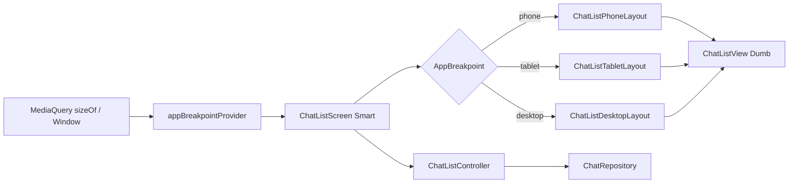
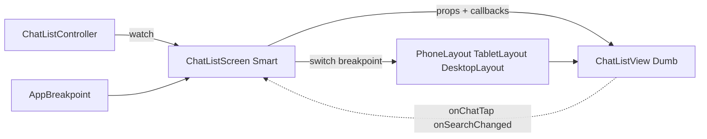
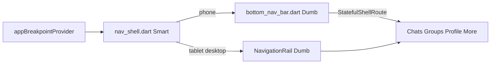
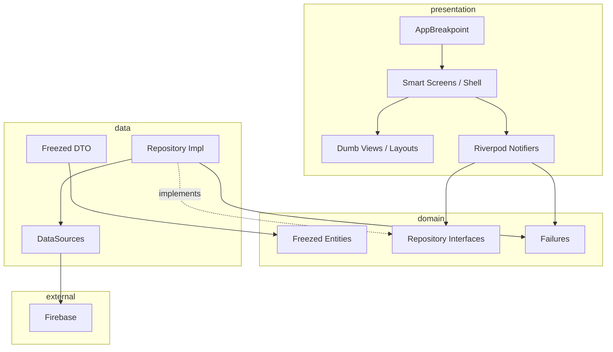

# Архитектура приложения E-Chat

Документ фиксирует целевую архитектуру Flutter-проекта **flutter_echat** с обязательным стеком:

| Технология | Роль |
| --- | --- |
| **Riverpod 3** + **аннотации** (`riverpod_annotation`) | DI, state management, реактивность UI |
| **Freezed** | Immutable-модели, union types, `copyWith` |
| **fpdart** | Функциональная обработка ошибок (`Either`, `Option`, `TaskEither`) |

Связанные документы: [firebase-database.md](./firebase-database.md), [firebase-setup.md](./firebase-setup.md), [firebase-flutter-connect.md](./firebase-flutter-connect.md), [firebase-events.md](./firebase-events.md).

Шпаргалки по стеку: [dart-riverpod.md](./dart-riverpod.md), [dart-fpdart.md](./dart-fpdart.md), [dart-freezed.md](./dart-freezed.md), [dart-classes.md](./dart-classes.md), [dart-future.md](./dart-future.md), [dart-stream.md](./dart-stream.md), [dart-map-enum.md](./dart-map-enum.md).

---

## Содержание

1. [Принципы](#1-принципы)
2. [Слои](#2-слои)
3. [Умный / глупый компонент](#3-умный--глупый-компонент)
4. [Адаптивный UI (phone / tablet / desktop)](#4-адаптивный-ui-phone--tablet--desktop)
5. [Структура каталогов](#5-структура-каталогов)
6. [Riverpod 3](#6-riverpod-3)
7. [Freezed](#7-freezed)
8. [fpdart](#8-fpdart)
9. [Поток данных](#9-поток-данных)
10. [Ошибки и Result](#10-ошибки-и-result)
11. [Features (модули)](#11-features-модули)
12. [Code generation](#12-code-generation)
13. [Тестирование](#13-тестирование)
14. [Правила для команды](#14-правила-для-команды)

---

## 1. Принципы

1. **Feature-first** — код группируется по фичам (auth, chats, groups), а не по типам файлов глобально.
2. **Unidirectional data flow** — UI → Notifier/Controller → Repository → DataSource → Firebase.
3. **Immutable state** — состояние экрана и доменные модели только через Freezed.
4. **Явные ошибки** — публичные методы репозиториев возвращают `Future<Either<Failure, T>>`, не бросают исключения наружу.
5. **Smart / Dumb** — умный контейнер подписывается на Riverpod и передаёт данные/колбэки; глупые виджеты только рисуют UI (см. [§3](#3-умный--глупый-компонент)).
6. **Один Notifier — много раскладок** — phone / tablet / desktop делят один controller и state; отличается только компоновка глупых виджетов.
7. **Firebase изолирован** — прямых вызовов Firestore/Auth из `presentation` нет. Подписки (`snapshots`, `onValue`) только в DataSource; как отлаживать события — [firebase-events.md](./firebase-events.md).

**Целевые форм-факторы:** phone (портрет), tablet (≥600 dp), desktop / wide (≥1024 dp, Windows / macOS / web / large tablet landscape).

---

## 2. Слои

```
┌─────────────────────────────────────────────────────────┐
│  PRESENTATION                                           │
│  Smart screens → Dumb widgets / layouts                 │
│  @riverpod Notifiers (UI state)                         │
└──────────────────────────┬──────────────────────────────┘
                           │ ref.read / ref.watch
┌──────────────────────────▼──────────────────────────────┐
│  APPLICATION (optional)                                 │
│  Use cases — только если логика reused в 2+ features    │
└──────────────────────────┬──────────────────────────────┘
                           │
┌──────────────────────────▼──────────────────────────────┐
│  DOMAIN                                                 │
│  Entities (Freezed), Repository interfaces, Failures    │
└──────────────────────────┬──────────────────────────────┘
                           │
┌──────────────────────────▼──────────────────────────────┐
│  DATA                                                   │
│  Repository impl, DTO (Freezed + json), DataSources       │
└──────────────────────────┬──────────────────────────────┘
                           │
                    Firebase / Local
```

| Слой | Зависит от | Не знает о |
| --- | --- | --- |
| **Presentation (smart)** | Domain, Riverpod, Adaptive shell | Firestore SDK, DTO, layout-детали |
| **Presentation (dumb)** | Flutter widgets, domain entities (read-only props) | Riverpod, Repository, Firebase, breakpoints |
| **Domain** | fpdart, Freezed | Flutter, Firebase, Riverpod |
| **Data** | Domain, Firebase SDK | Widgets, Notifiers |

---

## 3. Умный / глупый компонент

Паттерн **Container / Presentational** (smart / dumb) — обязателен для всех feature-экранов, особенно при поддержке нескольких форм-факторов.

### 3.1. Роли

| Тип | Ответственность | Запрещено |
| --- | --- | --- |
| **Smart** (`*_screen.dart`, `*_page.dart`, shell) | `ref.watch` / `ref.read`, выбор layout по breakpoint, маппинг state → props, вызов Notifier | тяжёлая вёрстка списков/пузырей, копипаст UI под каждое устройство |
| **Dumb** (`*_view.dart`, `*_body.dart`, tiles, bubbles) | отрисовка по props + callbacks (`VoidCallback`, `ValueChanged`) | `WidgetRef`, `ref.watch`, вызовы repository, знание `AppBreakpoint` |
| **Notifier** (`*_controller.dart`) | бизнес/UI state, Either → state | MediaQuery, BuildContext layout, «это tablet?» |

### 3.2. Поток в presentation

```
Breakpoint / WindowSize
        │
        ▼
┌───────────────────┐     watch/read      ┌──────────────────┐
│  Smart Screen     │ ◄────────────────── │  @riverpod       │
│  ChatListScreen   │ ──────────────────► │  ChatListCtrl    │
└─────────┬─────────┘     actions         └──────────────────┘
          │ props + callbacks
          ▼
┌───────────────────┐
│  Dumb layouts     │  ChatListPhoneView / TabletView / DesktopView
│  + shared widgets │  ChatListTile, ChatBubble, …
└───────────────────┘
```

### 3.3. Правила

1. **Один smart на route/feature-экран** — точка входа в фичу; внутри — только orchestration.
2. **Dumb не импортирует `flutter_riverpod`** — тестируется `pumpWidget` без `ProviderScope`.
3. **Shared dumb** живут в `shared/widgets/` или `feature/.../widgets/`; layout-варианты — рядом со screen в `layouts/` или как отдельные `*_view.dart`.
4. **Не плодить Notifier на форм-фактор** — `ChatListController` один; phone и desktop получают один и тот же `ChatListState`.
5. **Колбэки вместо side-effects в dumb** — `onChatTap(chatId)`, `onSend(text)`; навигацию и snackbar делает smart.

### 3.4. Пример

```dart
// SMART — знает Riverpod и breakpoint
class ChatListScreen extends ConsumerWidget {
  const ChatListScreen({super.key});

  @override
  Widget build(BuildContext context, WidgetRef ref) {
    final asyncState = ref.watch(chatListControllerProvider);
    final breakpoint = ref.watch(appBreakpointProvider);

    return asyncState.when(
      loading: () => const ChatListShimmer(),
      error: (err, _) => ErrorView(
        message: err is Failure ? err.displayMessage : 'Unknown error',
        onRetry: () => ref.invalidate(chatListControllerProvider),
      ),
      data: (state) {
        final view = ChatListView(
          state: state,
          onSearchChanged: (q) =>
              ref.read(chatListControllerProvider.notifier).setSearchQuery(q),
          onChatTap: (id) => ref.read(appRouterProvider).go('/chats/$id'),
        );

        return switch (breakpoint) {
          AppBreakpoint.phone => ChatListPhoneLayout(child: view),
          AppBreakpoint.tablet => ChatListTabletLayout(child: view),
          AppBreakpoint.desktop => ChatListDesktopLayout(child: view),
        };
      },
    );
  }
}

// DUMB — только UI
class ChatListView extends StatelessWidget {
  const ChatListView({
    super.key,
    required this.state,
    required this.onSearchChanged,
    required this.onChatTap,
  });

  final ChatListState state;
  final ValueChanged<String> onSearchChanged;
  final ValueChanged<String> onChatTap;

  @override
  Widget build(BuildContext context) {
    // список, search field, empty state — без ref
    ...
  }
}
```

### 3.5. Пример: страница регистрации (auth / register)

Страница регистрации живёт в фиче `features/auth/presentation/register/` и строится по той же схеме smart/dumb, что и Login ([§3.4](#34-пример)): один `@riverpod` Notifier на все ширины, на широких экранах форма ограничена `MaxWidthBox`.

```dart
// register_state.dart
@freezed
abstract class RegisterState with _$RegisterState {
  const factory RegisterState({
    @Default('') String name,
    @Default('') String phone,
    @Default('') String password,
    @Default(false) bool isSubmitting,
    @Default(false) bool agreedToTerms,
    Failure? error,
  }) = _RegisterState;
}
```

```dart
// register_controller.dart
@riverpod
class RegisterController extends _$RegisterController {
  @override
  RegisterState build() => const RegisterState();

  void setName(String v) => state = state.copyWith(name: v);
  void setPhone(String v) => state = state.copyWith(phone: v);
  void setPassword(String v) => state = state.copyWith(password: v);
  void setAgreedToTerms(bool v) => state = state.copyWith(agreedToTerms: v);

  Future<void> submit() async {
    state = state.copyWith(isSubmitting: true, error: null);
    final result = await ref.read(authRepositoryProvider).register(
          name: state.name,
          phone: state.phone,
          password: state.password,
        );
    state = state.copyWith(isSubmitting: false);
    result.fold(
      (failure) => state = state.copyWith(error: failure),
      (_) => ref.read(appRouterProvider).go('/otp'),
    );
  }
}
```

```dart
// register_screen.dart — SMART
class RegisterScreen extends ConsumerWidget {
  @override
  Widget build(BuildContext context, WidgetRef ref) {
    final state = ref.watch(registerControllerProvider);
    return MaxWidthBox(
      child: RegisterView(
        state: state,
        onNameChanged: (v) =>
            ref.read(registerControllerProvider.notifier).setName(v),
        onPhoneChanged: (v) =>
            ref.read(registerControllerProvider.notifier).setPhone(v),
        onPasswordChanged: (v) =>
            ref.read(registerControllerProvider.notifier).setPassword(v),
        onSubmit: () => ref.read(registerControllerProvider.notifier).submit(),
      ),
    );
  }
}
```

**Dumb `RegisterView`** получает только `RegisterState` + колбэки: поля Name / Phone / Password, чекбокс Terms, кнопка Register, сообщение об ошибке из `state.error.displayMessage`. Без `WidgetRef`, без вызова repository (см. [§3.3](#33-правила)).

**Правила:** на phone — full-height скролл-форма; на wide — центрированная колонка с `maxWidth`. Ошибки — только через sealed `Failure` (§10); переход после успеха — на `/otp`.

---

## 4. Адаптивный UI (phone / tablet / desktop)

### 4.1. Breakpoints

| Имя | Ширина (logical px) | Типичная оболочка |
| --- | --- | --- |
| `phone` | `< 600` | Bottom NavigationBar |
| `tablet` | `600 … 1023` | NavigationRail + опционально master–detail |
| `desktop` | `≥ 1024` | NavigationRail / Sidebar + master–detail + secondary pane |

Источник ширины: `MediaQuery.sizeOf(context)` или `Window` (desktop/web). Значение публикуется как `@riverpod` `appBreakpointProvider`, чтобы smart-экраны не дублировали пороги.

### 4.2. Navigation shell

| Форм-фактор | Shell | Стек чатов |
| --- | --- | --- |
| Phone | 4 вкладки снизу: Chats \| Groups \| Profile \| More | push route `/chats/:id` поверх списка |
| Tablet | NavigationRail слева | master–detail: список + thread в одном shell |
| Desktop | широкий rail / sidebar + optional right pane (info) | master–detail + панель информации о чате |

**Правило:** маршруты (`/chats`, `/chats/:id`) общие; меняется только то, как shell **вкладывает** дочерние routes (nested navigator / `StatefulShellRoute` + split view).

### 4.3. Master–detail (chats / groups)

На tablet/desktop список и переписка живут рядом:

```
┌────────┬──────────────┬─────────────────┬────────────┐
│ Rail   │ Chat list    │ Thread          │ Info       │  desktop
│        │ (dumb)       │ (dumb)          │ (optional) │
└────────┴──────────────┴─────────────────┴────────────┘

┌────────┬──────────────┬─────────────────┐
│ Rail   │ Chat list    │ Thread          │  tablet
└────────┴──────────────┴─────────────────┘

┌──────────────────────┐
│ Chat list            │  phone → tap → full-screen thread
└──────────────────────┘
```

Smart-оболочка `ChatsShellScreen` смотрит `selectedChatId` + breakpoint и собирает раскладку из одних и тех же dumb: `ChatListView`, `ChatThreadView`.

### 4.4. Что не адаптировать отдельно

- Domain, Data, Notifiers, Failure — **форм-фактор-агностичны**.
- Auth OTP, мелкие модалки — часто один layout с `ConstrainedBox` / `maxWidth` на desktop.
- Тема, локализация, design tokens — общие; меняются spacing / density / max content width.

### 4.5. Платформы

| Платформа | Ожидание |
| --- | --- |
| Android / iOS phone | phone layout |
| Android / iOS tablet | tablet (или desktop в landscape при ≥1024) |
| Windows / macOS / Linux | desktop layout |
| Web | breakpoints по ширине окна |

Firebase / WebRTC / file picker могут отличаться по платформе в **Data** или `shared/services`, не в dumb-виджетах.

### 4.6. Практический разбор: как выбирается верстка на примере feature/chats

Ниже — сквозной ответ на вопрос «как и где выбирается верстка для phone / tablet / desktop», привязанный к фиче `chats`. Этот раздел описывает **целевую структуру**: в текущем коде существует только `lib/main.dart`, а `features/chats/` и `app/adaptive/` предстоит реализовать по этому плану.

#### 1. Где живут breakpoints и как определяется форм-фактор

Единая точка правды для порогов — папка `app/adaptive/`:

| Файл | Что делает |
| --- | --- |
| `app/adaptive/breakpoints.dart` | `enum AppBreakpoint { phone, tablet, desktop }` + сами пороги |
| `app/adaptive/app_breakpoint_provider.dart` | `@riverpod appBreakpointProvider` — публикует текущее значение `AppBreakpoint` |
| `app/adaptive/responsive_builder.dart` | optional helper, только для smart-слоя |

Пороги: `phone` `< 600`, `tablet` `600 … 1023`, `desktop` `≥ 1024`. Источник ширины — `MediaQuery.sizeOf(context)` или `Window` на desktop/web. Провайдер пересчитывает это значение один раз; smart-экраны пороги не дублируют (прямой `MediaQuery` в фичах запрещён, см. §14 DON'T).

#### 2. Кто выбирает верстку — Smart-экран

Выбор делает **smart**-компонент через `switch` по breakpoint — это суть принципа «Один Notifier — много раскладок» (§1 п.6, §3.3 п.4): controller и state общие, отличается только компоновка глупых виджетов.

```dart
// features/chats/presentation/chat_list/chat_list_screen.dart
final breakpoint = ref.watch(appBreakpointProvider);

return switch (breakpoint) {
  AppBreakpoint.phone   => ChatListPhoneLayout(child: view),
  AppBreakpoint.tablet  => ChatListTabletLayout(child: view),
  AppBreakpoint.desktop => ChatListDesktopLayout(child: view),
};
```

Алгоритм для `chats`:

1. Smart-экран `ChatListScreen` подписывается на `chatListControllerProvider` (`AsyncValue<ChatListState>`) и на `appBreakpointProvider`.
2. Внутри `asyncState.when(data: ...)` собирает **общий** dumb-view `ChatListView` с props + колбэками (`onSearchChanged`, `onChatTap`).
3. По значению `breakpoint` оборачивает этот общий view в одну из трёх layout-обёрток.
4. Навигацию делает smart: `onChatTap: (id) => ref.read(appRouterProvider).go('/chats/$id')`.

#### 3. Где находятся сами верстки (для chats)

Верстки — **dumb**-компоненты в `features/chats/presentation/`:

```
features/chats/presentation/
├── shell/
│   └── chats_shell_screen.dart      # SMART: master–detail, собирает list + thread
├── chat_list/
│   ├── chat_list_screen.dart        # SMART (или часть shell)
│   ├── chat_list_view.dart          # DUMB — список/поиск/empty state
│   ├── chat_list_controller.dart    # один Notifier на все форм-факторы
│   └── chat_list_state.dart
├── chat_thread/
│   ├── chat_thread_screen.dart      # SMART
│   ├── chat_thread_view.dart        # DUMB
│   ├── chat_thread_controller.dart
│   └── chat_thread_state.dart
└── widgets/                         # DUMB feature-widgets (tiles, bubbles)
```

Layout-варианты лежат либо в `layouts/` рядом со screen, либо как отдельные `*_view.dart` — для chats это `ChatListPhoneLayout` / `ChatListTabletLayout` / `ChatListDesktopLayout`. Папки `mobile/`, `tablet/`, `desktop/` с копиями целых фич **не создаются** — только разные композиции одних dumb (§5). Переиспользуемые обёртки — в `shared/layouts/`: `MaxWidthBox`, `TwoPane`, `ThreePane`.

Поведение по форм-фактору:

- phone: одна колонка, список на весь экран, тап → full-screen thread.
- tablet: `NavigationRail` слева + master–detail (список + переписка рядом).
- desktop: широкий rail/sidebar + optional right pane (инфо о чате) + master–detail.

На tablet/desktop `ChatsShellScreen` собирает `TwoPane(list + ChatThreadView)` по `selectedChatId` + breakpoint (§4.3, §9).

#### 4. Поток выбора верстки (схема)



**Резюме:** версию верстки выбирает единственный smart-экран, читая `AppBreakpoint` из общего провайдера; сами верстки — dumb-обёртки и views в `features/chats/presentation/` (list / thread / shell) плюс переиспользуемые `shared/layouts/`. Один и тот же `ChatListState` и controller используются всеми форм-факторами.

### 4.7. Зачем нужен `chat_list_state.dart`

`chat_list_state.dart` — это **UI-состояние** фичи `chats`, описанное через Freezed. По архитектуре (§3, §7.4) каждый smart-экран имеет свою пару «state + controller».

**Зачем он нужен:** определяет, какие данные и флаги видит dumb-view `ChatListView`. Например:

```dart
// features/chats/presentation/chat_list/chat_list_state.dart
@freezed
abstract class ChatListState with _$ChatListState {
  const factory ChatListState({
    @Default(<Chat>[]) List<Chat> chats,
    @Default('') String query,
  }) = _ChatListState;
}
```

Роль в потоке данных:
- Controller (`chat_list_controller.dart`) держит это состояние в `AsyncValue<ChatListState>` и меняет его через `copyWith`: пришёл стрим чатов → обновились `chats`, пользователь печатает поиск → обновился `query` (§6.5).
- Smart-экран (`chat_list_screen.dart`) читает `ref.watch(chatListControllerProvider)` и в `data:` передаёт `ChatListState` в dumb-view.
- Dumb-view (`chat_list_view.dart`) получает `state` как props и только рисует по нему: фильтрация по `query`, рендер `chats`, empty state (§3.4).

Почему это важно (архитектурные принципы):
- **Immutable state** (§1 п.3) — только через Freezed, без мутируемого состояния.
- **Один state на все форм-факторы** (§1 п.6) — phone / tablet / desktop читают один и тот же `ChatListState`; сам файл форм-фактор-агностичен и не знает про breakpoints.
- **Smart/Dumb разделение** (§3.1) — dumb не знает про Riverpod и репозиторий, он знает только `ChatListState` + колбэки, поэтому тестируется простым `pumpWidget` без `ProviderScope` (§13).

**Резюме:** `chat_list_state.dart` — единый immutable «снимок» данных и UI-флагов экрана списка чатов, создаётся controller'ом, передаётся smart'ом в dumb-view и одинаков для всех трёх раскладок.

### 4.8. Что делают `chat_list_screen.dart` и `chat_list_view.dart`

Пара «smart screen + dumb view» — ядро паттерна Smart/Dumb (§3) для экрана списка чатов. Это **целевая структура**: в текущем коде существует только `lib/main.dart`, а `features/chats/` предстоит реализовать по этому плану (§4.6).

#### `chat_list_screen.dart` — SMART-компонент

Расположение: `features/chats/presentation/chat_list/chat_list_screen.dart`. Это «умный контейнер», который **только оркестрирует**: подписывается на Riverpod, выбирает вёрстку по breakpoint и передаёт данные + колбэки в глупые виджеты. Полный пример — [§3.4](#34-пример).

Что он делает:

1. **Подписывается на состояние** — `ref.watch(chatListControllerProvider)` (`AsyncValue<ChatListState>`) и `ref.watch(appBreakpointProvider)` (§6.6).
2. **Обрабатывает три состояния `AsyncValue`:**
   - `loading:` → `ChatListShimmer`;
   - `error:` → `ErrorView` с текстом из `Failure.displayMessage` и `onRetry` → `ref.invalidate(chatListControllerProvider)`;
   - `data:` → собирает общий dumb-view `ChatListView`.
3. **Маппит state → props + callbacks**:
   - `state: state`,
   - `onSearchChanged: (q) => ref.read(chatListControllerProvider.notifier).setSearchQuery(q)`,
   - `onChatTap: (id) => ref.read(appRouterProvider).go('/chats/$id')` — навигацию делает smart, не dumb.
4. **Выбирает layout по breakpoint** — принцип «один Notifier — много раскладок» (§1 п.6): один и тот же `ChatListView` оборачивается в `ChatListPhoneLayout` / `ChatListTabletLayout` / `ChatListDesktopLayout` по значению `AppBreakpoint` (§4.6).

#### `chat_list_view.dart` — DUMB-компонент

Расположение: `features/chats/presentation/chat_list/chat_list_view.dart`. Это «глупый» виджет — **только рисует UI по полученным props**. Пример — [§3.4](#34-пример).

Что он делает:

1. **Принимает данные как props**: `ChatListState state` + колбэки `ValueChanged<String> onSearchChanged`, `ValueChanged<String> onChatTap`.
2. **Рендерит интерфейс списка чатов**: сам список, поле поиска, empty state («No chats»); фильтрация чатов по `query` из `state` выполняется здесь.
3. **Не знает ни о Riverpod, ни о репозитории, ни о Firebase** — правило §3.3 п.2 и §14 DON'T: dumb не импортирует `flutter_riverpod`, не использует `WidgetRef`, не вызывает `MediaQuery` и не знает про breakpoints.
4. **Все действия отдаёт через колбэки** — side-effects (навигация, snackbar, вызовы Notifier) делает smart.

#### Взаимосвязь (паттерн Smart/Dumb)



#### Ключевые правила

| Правило | Реализация |
| --- | --- |
| Один smart на экран (§3.3 п.1) | `ChatListScreen` — единственная точка входа |
| Dumb без Riverpod (§3.3 п.2) | `ChatListView` — `StatelessWidget` без `ref` |
| Один Notifier на все форм-факторы (§3.3 п.4) | controller и `ChatListState` общие |
| Колбэки вместо side-effects (§3.3 п.5) | `onChatTap`, `onSearchChanged` |
| Immutable state (§1 п.3) | данные приходят как Freezed `ChatListState` |

**Резюме:** `chat_list_screen.dart` — умный оркестратор (данные + выбор раскладки), а `chat_list_view.dart` — переиспользуемый глупый виджет, который получает один и тот же `ChatListState` и колбэки независимо от того, на phone, tablet или desktop он отрисован.

### 4.9. Где находится вёрстка Bottom Navigation Bar

Bottom Navigation Bar — это **dumb-компонент**, который по архитектуре живёт в `shared/widgets/`, потому что это переиспользуемый виджет уровня приложения (не фичи).

#### Вёрстка самого бара

```
lib/shared/widgets/bottom_nav_bar.dart   # DUMB: 4 вкладки Chats|Groups|Profile|More (phone)
```

Файл добавлен в структуру каталогов в [§5](#5-структура-каталогов). Это глупый виджет: без Riverpod, без `ref`, без `MediaQuery`. Он получает от smart-shell данные через props (выбранную вкладку + `onDestinationSelected`) и просто рисует `BottomNavigationBar` — тело бара и пункты вкладок.

#### Кто выбирает, что показывать (smart-слой)

Сама вёрстка бара — dumb, но **решение, когда показывать bar или rail**, принимает умный shell:

```
lib/app/router/nav_shell.dart       # SMART: StatefulShellRoute, выбор оболочки по breakpoint
lib/app/router/app_router.dart      # SMART shell: phone bottom / tablet|desktop rail
```

Здесь читается `appBreakpointProvider` (§4.1):

- `phone` → dumb `BottomNavigationBar` из `shared/widgets/bottom_nav_bar.dart`;
- `tablet` / `desktop` → dumb `NavigationRail` (в том же `shared/widgets/`).

#### Схема



**Резюме:** вёрстка Bottom Navigation Bar находится в dumb-виджете `shared/widgets/bottom_nav_bar.dart` — там тело бара и пункты вкладок; а умная логика выбора между bar и rail — в `app/router/nav_shell.dart` / `app_router.dart`. Так соблюдается правило «Smart выбирает раскладку, Dumb её рисует» (§3.1).

---

## 5. Структура каталогов

```
lib/
├── main.dart
├── app/
│   ├── app.dart                 # MaterialApp, тема, router
│   ├── router/
│   │   ├── app_router.dart      # SMART shell: phone bottom / tablet|desktop rail
│   │   └── nav_shell.dart       # SMART: StatefulShellRoute, выбор оболочки по breakpoint
│   ├── adaptive/
│   │   ├── breakpoints.dart     # AppBreakpoint enum + пороги
│   │   ├── app_breakpoint_provider.dart
│   │   └── responsive_builder.dart  # optional helper (smart-only)
│   └── providers/
│       └── app_providers.dart   # theme, locale
│
├── core/
│   ├── error/
│   │   └── failures.dart        # Freezed Failure hierarchy
│   ├── extensions/
│   ├── utils/
│   └── constants/
│
├── shared/
│   ├── widgets/                 # DUMB: Button, Avatar, ChatBubble…
│   │   └── bottom_nav_bar.dart  # DUMB: 4 вкладки Chats|Groups|Profile|More (phone)
│   ├── layouts/                 # DUMB: MaxWidthBox, TwoPane, ThreePane
│   └── providers/               # firebase, shared services
│
└── features/
    ├── auth/
    │   ├── domain/
    │   │   ├── entities/
    │   │   │   └── auth_user.dart
    │   │   └── repositories/
    │   │       └── auth_repository.dart
    │   ├── data/
    │   │   ├── datasources/
    │   │   │   └── auth_remote_datasource.dart
    │   │   ├── dto/
    │   │   │   └── user_dto.dart
    │   │   └── repositories/
    │   │       └── auth_repository_impl.dart
    │   └── presentation/
    │       ├── login/
    │       │   ├── login_screen.dart      # SMART
    │       │   ├── login_view.dart        # DUMB
    │       │   ├── login_controller.dart
    │       │   └── login_state.dart
    │       ├── register/
    │       │   ├── register_screen.dart   # SMART
    │       │   ├── register_view.dart     # DUMB
    │       │   ├── register_controller.dart
    │       │   └── register_state.dart
    │       └── otp/
    │           ├── otp_screen.dart
    │           ├── otp_view.dart
    │           ├── otp_controller.dart
    │           └── otp_state.dart
    │
    ├── chats/
    │   └── presentation/
    │       ├── shell/
    │       │   └── chats_shell_screen.dart   # SMART: master–detail
    │       ├── chat_list/
    │       │   ├── chat_list_screen.dart     # SMART (или часть shell)
    │       │   ├── chat_list_view.dart       # DUMB
    │       │   ├── chat_list_controller.dart
    │       │   └── chat_list_state.dart
    │       ├── chat_thread/
    │       │   ├── chat_thread_screen.dart
    │       │   ├── chat_thread_view.dart
    │       │   ├── chat_thread_controller.dart
    │       │   └── chat_thread_state.dart
    │       └── widgets/                      # DUMB feature widgets
    ├── groups/
    ├── profile/
    └── more/
```

**Правило именования файлов:**

| Тип | Шаблон | Пример |
| --- | --- | --- |
| Smart-экран | `{name}_screen.dart` | `chat_list_screen.dart` |
| Dumb-view | `{name}_view.dart` | `chat_list_view.dart` |
| Layout-обёртка (dumb) | `{name}_layout.dart` / `two_pane.dart` | `chats_tablet_layout.dart` |
| Notifier | `{name}_controller.dart` | `chat_list_controller.dart` |
| UI state | `{name}_state.dart` | `chat_list_state.dart` |
| Repository (interface) | `{name}_repository.dart` | `chat_repository.dart` |
| Repository (impl) | `{name}_repository_impl.dart` | `chat_repository_impl.dart` |
| DTO | `{name}_dto.dart` | `message_dto.dart` |
| Entity | `{name}.dart` | `message.dart` |

**Не создавать** папки `mobile/`, `tablet/`, `desktop/` с копиями целых фич — только разные layout-композиции одних dumb-виджетов.

---

## 6. Riverpod 3

### 6.1. Пакеты

```yaml
dependencies:
  flutter_riverpod: ^3.0.0
  riverpod_annotation: ^3.0.0
  freezed_annotation: ^3.0.0
  json_annotation: ^1.9.0
  fpdart: ^1.1.0

dev_dependencies:
  riverpod_generator: ^3.0.0
  freezed: ^3.0.0
  build_runner: ^2.4.0
  json_serializable: ^6.9.0
```

### 6.2. Обязательное использование аннотаций

**Запрещено** в production-коде:

- ручное объявление `Provider(...)`, `FutureProvider(...)` без codegen;
- `StateNotifier` / `ChangeNotifier` для новых фич.

**Разрешено и обязательно:**

- `@riverpod` / `@Riverpod` + `riverpod_generator`;
- `@Riverpod(keepAlive: true)` для singleton-сервисов (Firebase, repositories);
- `part '{file}.g.dart';` в каждом файле с аннотациями.

### 6.3. Типы провайдеров

| Задача | Аннотация | Пример |
| --- | --- | --- |
| Repository / Service | `@Riverpod(keepAlive: true)` | `AuthRepository`, `ChatRepository` |
| Stream данных | `@riverpod` → `Stream<T>` | список чатов, сообщения |
| Async загрузка | `@riverpod` class extends `_$X extends AsyncNotifier` | `ChatListController` |
| Синхронный UI state | `@riverpod` class extends `_$X extends Notifier` | форма Login, OTP |
| Параметризованный | `@riverpod` с аргументами | `messageList(chatId)` |

### 6.4. Пример: repository provider

```dart
// features/chats/data/repositories/chat_repository_impl.dart
// + part и register в том же feature

// features/chats/presentation/providers/chat_repository_provider.dart
import 'package:riverpod_annotation/riverpod_annotation.dart';

part 'chat_repository_provider.g.dart';

@Riverpod(keepAlive: true)
ChatRepository chatRepository(Ref ref) {
  return ChatRepositoryImpl(
    firestore: ref.watch(firestoreProvider),
    auth: ref.watch(firebaseAuthProvider),
  );
}
```

### 6.5. Пример: AsyncNotifier для списка чатов

```dart
// features/chats/presentation/chat_list/chat_list_controller.dart
import 'dart:async';

import 'package:riverpod_annotation/riverpod_annotation.dart';

part 'chat_list_controller.g.dart';

// Realtime-источник: один стрим Firestore, каждая эмиссия несёт sealed Failure
// внутри Either (ошибки подписки оборачиваются в Left через handleError).
@riverpod
Stream<Either<Failure, List<Chat>>> chatListStream(Ref ref) =>
    ref.watch(chatRepositoryProvider).watchChats();

@riverpod
class ChatListController extends _$ChatListController {
  StreamSubscription<Either<Failure, List<Chat>>>? _sub;

  @override
  Future<ChatListState> build() async {
    final stream = ref.watch(chatListStreamProvider);
    ref.onDispose(() => _sub?.cancel());

    // Ошибки попадают в AsyncValue.error как sealed Failure.
    _sub = stream.listen(
      (result) => result.fold(
        (failure) => state = AsyncError(failure, StackTrace.current),
        (chats) => state = AsyncData(
          (state.value ?? const ChatListState(chats: [], query: ''))
              .copyWith(chats: chats),
        ),
      ),
      onError: (Object e, StackTrace st) =>
          state = AsyncError(e is Failure ? e : Failure.unexpected(e), st),
    );

    return const ChatListState(chats: [], query: '');
  }

  Future<void> refresh() async {
    state = await AsyncValue.guard(() async {
      final result = await ref.read(chatRepositoryProvider).getChats();
      return result.fold(
        (failure) => throw failure, // sealed Failure → AsyncValue.error
        (chats) => (state.value ?? const ChatListState(chats: [], query: ''))
            .copyWith(chats: chats),
      );
    });
  }

  void setSearchQuery(String query) {
    final current = state.value;
    if (current == null) return;
    state = AsyncData(current.copyWith(query: query));
  }
}
```

### 6.6. Пример: Smart UI → Dumb view

Smart подписывается на провайдеры; dumb получает только данные и колбэки. Полный пример с breakpoints — в [§3.4](#34-пример).

```dart
class ChatListScreen extends ConsumerWidget {
  const ChatListScreen({super.key});

  @override
  Widget build(BuildContext context, WidgetRef ref) {
    final asyncState = ref.watch(chatListControllerProvider);

    return asyncState.when(
      loading: () => const ChatListShimmer(),
      error: (err, _) => ErrorView(
        message: err is Failure ? err.displayMessage : 'Unknown error',
        onRetry: () => ref.invalidate(chatListControllerProvider),
      ),
      data: (state) => ChatListView(
        state: state,
        onSearchChanged: (q) =>
            ref.read(chatListControllerProvider.notifier).setSearchQuery(q),
        onChatTap: (id) => ref.read(appRouterProvider).go('/chats/$id'),
      ),
    );
  }
}
```

### 6.7. `main.dart`

```dart
void main() async {
  WidgetsFlutterBinding.ensureInitialized();
  await Firebase.initializeApp(options: DefaultFirebaseOptions.currentPlatform);

  runApp(
    const ProviderScope(
      child: EChatApp(),
    ),
  );
}
```

### 6.8. Override для тестов

```dart
ProviderScope(
  overrides: [
    chatRepositoryProvider.overrideWithValue(FakeChatRepository()),
  ],
  child: const MaterialApp(home: ChatListScreen()),
);
```

---

## 7. Freezed

### 7.1. Где применять

| Объект | Freezed | json_serializable |
| --- | --- | --- |
| Domain entity | да | нет |
| DTO (Firestore) | да | да (`fromJson` / `toJson`) |
| UI state | да | нет |
| Failure / sealed errors | да (`@freezed sealed`) | нет |
| Union (OTP step, Auth flow) | да | нет |

### 7.2. Entity (domain)

```dart
// features/chats/domain/entities/message.dart
import 'package:freezed_annotation/freezed_annotation.dart';

part 'message.freezed.dart';

@freezed
abstract class Message with _$Message {
  const factory Message({
    required String id,
    required String chatId,
    required String senderId,
    required MessageType type,
    required String? text,
    required MessageStatus status,
    required DateTime createdAt,
  }) = _Message;
}

enum MessageType { text, image, video, audio, voice, file, system }

enum MessageStatus { sending, sent, delivered, read, failed }
```

### 7.3. DTO + маппинг

```dart
// features/chats/data/dto/message_dto.dart
@freezed
abstract class MessageDto with _$MessageDto {
  const factory MessageDto({
    required String id,
    required String senderId,
    required String type,
    String? text,
    @TimestampConverter() required DateTime createdAt,
  }) = _MessageDto;

  factory MessageDto.fromJson(Map<String, dynamic> json) =>
      _$MessageDtoFromJson(json);
}

extension MessageDtoX on MessageDto {
  Message toEntity(String chatId) => Message(
        id: id,
        chatId: chatId,
        senderId: senderId,
        type: MessageType.values.byName(type),
        text: text,
        status: MessageStatus.sent,
        createdAt: createdAt,
      );
}
```

### 7.4. UI state

```dart
// features/auth/presentation/otp/otp_state.dart
@freezed
abstract class OtpState with _$OtpState {
  const factory OtpState({
    required String verificationId,
    required String phoneDisplay,
    required Duration resendCooldown,
    @Default('') String code,
    @Default(false) bool isSubmitting,
    Failure? error,
  }) = _OtpState;
}
```

### 7.5. Sealed failures

```dart
// core/error/failures.dart
@freezed
sealed class Failure with _$Failure {
  const Failure._();

  const factory Failure.network([String? message]) = NetworkFailure;
  const factory Failure.auth(AuthFailureReason reason) = AuthFailure;
  const factory Failure.firestore(String code) = FirestoreFailure;
  const factory Failure.notFound() = NotFoundFailure;
  const factory Failure.unexpected(Object error) = UnexpectedFailure;

  String get displayMessage => switch (this) {
        NetworkFailure(:final message) => message ?? 'Нет сети',
        AuthFailure(:final reason) => reason.message,
        FirestoreFailure(:final code) => 'Ошибка базы: $code',
        NotFoundFailure() => 'Не найдено',
        UnexpectedFailure() => 'Что-то пошло не так',
      };
}
```

---

## 8. fpdart

### 8.1. Правила

1. **Repository** возвращает `Future<Either<Failure, T>>` или `Stream<Either<Failure, T>>`.
2. **Option** вместо `null` там, где «значения может не быть» в domain (avatar, draft). **Ошибки — никогда через `Option`**: только sealed `Failure`.
3. **TaskEither** — для композиции нескольких async-шагов в use case или repository.
4. **Do-нотация** — композиция 2+ шагов `Either` / `Option` / `TaskEither` только через `*.Do(($ ) { ... })`, не через вложенный `flatMap`. Один шаг — `TaskEither.tryCatch` без Do. На границе Notifier → UI — `fold` / `match`.
5. Исключения Firebase **перехватываются только в DataSource** и маппятся в `Failure`.

### 8.2. Repository interface

```dart
// features/chats/domain/repositories/chat_repository.dart
abstract class ChatRepository {
  Stream<Either<Failure, List<Chat>>> watchChats();
  Future<Either<Failure, Chat>> getChatById(String chatId);
  Future<Either<Failure, Unit>> sendMessage({
    required String chatId,
    required String text,
  });
}
```

### 8.3. Repository implementation

Один async-шаг — `TaskEither.tryCatch`, Do не нужен:

```dart
@override
Future<Either<Failure, Unit>> sendMessage({
  required String chatId,
  required String text,
}) {
  return TaskEither.tryCatch(
    () => _remote.sendMessage(chatId: chatId, text: text),
    (e, _) => e is FirebaseException
        ? Failure.firestore(e.code)
        : Failure.unexpected(e),
  ).map((_) => unit).run();
}
```

### 8.4. Цепочка TaskEither.Do (создание группы)

`$` достаёт `Right` / `Some`. Любой `Left` / `None` сразу останавливает цепочку.

```dart
Future<Either<Failure, Chat>> createGroup({
  required String title,
  required List<String> memberIds,
}) {
  return TaskEither<Failure, Chat>.Do(($) async {
    final uid = await $(
      TaskEither.fromEither(
        Option.fromNullable(_auth.currentUser?.uid).toEither(
          () => const Failure.auth(AuthFailureReason.notSignedIn),
        ),
      ),
    );

    final chatId = _firestore.collection('chats').doc().id;

    await $(
      TaskEither.tryCatch(
        () => _remote.createGroup(
          chatId: chatId,
          title: title,
          creatorId: uid,
          memberIds: [...memberIds, uid],
        ),
        (e, _) => e is FirebaseException
            ? Failure.firestore(e.code)
            : Failure.unexpected(e),
      ),
    );

    return await $(TaskEither(() => getChatById(chatId)));
  }).run();
}
```

Синхронные цепочки — `Either.Do` / `Option.Do` без `async` / `await`:

```dart
final result = Either<Failure, int>.Do(($) {
  final a = $(parseId(raw));
  final b = $(validatePositive(a));
  return b * 2;
});
```

Внутри `Do()` нельзя: `throw` вручную; `await` без `$`; вкладывать один `Do()` в другой; вызывать `$` внутри другого колбэка (`map`, `then`, `forEach`).

### 8.5. Notifier + Either

На границе UI Do не нужен: разбор результата через `fold`.

```dart
Future<void> submitOtp() async {
  state = state.copyWith(isSubmitting: true, error: null);

  final result = await ref.read(authRepositoryProvider).confirmOtp(
        verificationId: state.verificationId,
        code: state.code,
      );

  result.fold(
    (failure) => state = state.copyWith(
      isSubmitting: false,
      error: failure, // sealed Failure → текст берётся из displayMessage
    ),
    (_) {
      state = state.copyWith(isSubmitting: false);
      ref.read(appRouterProvider).go('/home');
    },
  );
}
```

---

## 9. Поток данных

Пример: **отправка сообщения** (Chats _ Conversation).

```
ChatInputView.onSend                          # DUMB callback
    → ChatThreadScreen (SMART) → notifier.send(text)
        → ChatRepository.sendMessage()
            → ChatRemoteDataSource.sendMessage()
                → Firestore chats/{id}/messages
        ← Either<Failure, Unit>
    ← обновление optimistic UI / error snackbar (SMART)
```

Пример: **realtime typing** (Realtime Database, не Firestore).

```
TypingRemoteDataSource (RTDB)
    → TypingRepository
        → @riverpod Stream<bool> peerTyping(chatId, peerId)
            → ChatThreadScreen (SMART) → ChatThreadView (DUMB indicator)
```

Пример: **выбор чата на desktop**.

```
ChatListView.onChatTap(id)                    # DUMB
    → ChatsShellScreen                        # SMART
        → update selectedChatId / router
        → TwoPane(list + ChatThreadView)      # DUMB layout + views
```

---

## 10. Ошибки и Result

| Уровень | Формат ошибки |
| --- | --- |
| DataSource | `try/catch` → throw или return raw |
| Repository | `Either<Failure, T>` |
| Notifier | `fold` → sealed `Failure` в state или `AsyncValue.error` с sealed `Failure` |
| Smart UI | `Failure.displayMessage`, retry, snackbar |
| Dumb UI | отображает `Failure.displayMessage` / `onRetry` из props |

> Все ошибки в системе — sealed `Failure` (см. §7.5). `String` / `Option<String>` для ошибок не используются: UI берёт текст только из `Failure.displayMessage`.

**Optimistic UI** для сообщений:

1. Notifier добавляет `Message` со `status: sending` в локальный state.
2. Repository возвращает `Either`.
3. При `Right` — `status: sent`; при `Left` — `status: failed` + retry action.

---

## 11. Features (модули)

Соответствие вкладкам Figma и слоям:

| Feature | Presentation (smart → dumb) | Domain | Data sources |
| --- | --- | --- | --- |
| `onboarding` | Introduce, Loading | — | SharedPreferences |
| `auth` | Login, OTP, User Info | AuthRepository | Firebase Auth, Firestore `users` |
| `security` | PIN, Face/Touch ID | — | secure_storage (local) |
| `chats` | Shell + list/thread (master–detail на tablet/desktop) | ChatRepository, Message | Firestore, RTDB typing |
| `groups` | Group list, create, members (+ split view) | ChatRepository | Firestore |
| `calls` | Call, Video calling | CallRepository | Firestore `calls` + WebRTC provider |
| `contacts` | Add Friend | ContactRepository | Firestore `contacts`, `users` |
| `profile` | Profile, Edit (`maxWidth` на desktop) | UserRepository | Firestore `users` |
| `more` | Settings, Language, Theme | SettingsRepository | Firestore `userSettings` |
| `notifications` | Notification list | NotificationRepository | Firestore, FCM |

Каждый feature **самодостаточен**: своё `presentation`, `domain`, `data`. Общее — только `core/`, `shared/`, `app/adaptive/`.

Presentation внутри feature всегда: **smart screen** + **dumb view(s)** + **controller/state**. Layout-варианты phone/tablet/desktop — композиции dumb, не отдельные фичи.

---

## 12. Code generation

### 12.1. Команды

```bash
# Однократная генерация
dart run build_runner build --delete-conflicting-outputs

# Watch при разработке
dart run build_runner watch --delete-conflicting-outputs
```

### 12.2. Генерируемые файлы

| Инструмент | Вход | Выход |
| --- | --- | --- |
| `riverpod_generator` | `@riverpod` | `*.g.dart` |
| `freezed` | `@freezed` | `*.freezed.dart` |
| `json_serializable` | `@JsonSerializable` | `*.g.dart` |

**В git:** коммитить `*.freezed.dart` и `*.g.dart` — optional; команда может генерировать в CI. Для соло-разработки удобнее коммитить.

### 12.3. `analysis_options.yaml`

Подключите lint для Riverpod:

```yaml
analyzer:
  plugins:
    - custom_lint

dev_dependencies:
  custom_lint: ^0.7.0
  riverpod_lint: ^3.0.0
```

---

## 13. Тестирование

| Слой | Что тестировать | Как |
| --- | --- | --- |
| Domain | маппинг DTO → Entity | unit, pure Dart |
| Data | Repository | mock DataSource, проверка `Either` |
| Presentation | Notifier | `ProviderContainer` + overrides |
| Dumb widgets | UI по props | `pumpWidget` **без** ProviderScope |
| Smart screens | wiring + breakpoint layouts | `ProviderScope` + fake size / override `appBreakpointProvider` |
| Widget golden | phone / tablet / desktop | отдельные golden по breakpoint |

```dart
test('sendMessage returns Left on firestore error', () async {
  final container = ProviderContainer(
    overrides: [
      chatRepositoryProvider.overrideWithValue(FakeChatRepository(fail: true)),
    ],
  );
  addTearDown(container.dispose);

  final notifier = container.read(chatThreadControllerProvider('c1').notifier);
  await notifier.send('hello');

  expect(container.read(chatThreadControllerProvider('c1')).value?.lastError, isNotNull);
});
```

```dart
testWidgets('ChatListView shows empty state', (tester) async {
  await tester.pumpWidget(
    MaterialApp(
      home: ChatListView(
        state: const ChatListState(chats: [], query: ''),
        onSearchChanged: (_) {},
        onChatTap: (_) {},
      ),
    ),
  );
  expect(find.text('No chats'), findsOneWidget);
});
```

---

## 14. Правила для команды

### DO

- `@riverpod` / `@Riverpod` для всех новых провайдеров.
- Freezed для state, entity, failure.
- `Either<Failure, T>` на границе domain ↔ data.
- fpdart: `TaskEither.Do` / `Either.Do` / `Option.Do` для цепочек из 2+ шагов.
- **Smart** = `ConsumerWidget` / `ConsumerStatefulWidget`; **Dumb** = `StatelessWidget` / `StatefulWidget` без Riverpod.
- Один controller на фичу-экран; отдельные layouts для phone / tablet / desktop.
- Маппинг DTO → Entity только в `data/`.
- `ref.invalidate` / `ref.refresh` для pull-to-refresh.
- Breakpoints только через `appBreakpointProvider` / `app/adaptive/`.

### DON'T

- `FirebaseFirestore.instance` в виджетах.
- `ref.watch` / `WidgetRef` в dumb (`*_view.dart`, shared widgets).
- Отдельные Notifier или feature-копии «для tablet» / «для desktop».
- `setState` для бизнес-логики (только локальная анимация/форма без state).
- `dynamic` / `Map<String, dynamic>` в domain и presentation.
- Проглатывание ошибок (`catch (_) {}` без `Failure`).
- `String` / `Option<String>` для ошибок — все ошибки только через sealed `Failure`.
- Вложенный `flatMap` вместо Do-нотации fpdart.
- Циклические imports между features — выносить контракты в `domain` или `shared`.
- Хардкод `MediaQuery` порогов в feature-виджетах в обход `AppBreakpoint`.

### Чеклист PR

- [ ] `dart run build_runner build` проходит
- [ ] `flutter analyze` без ошибок
- [ ] Новые провайдеры через аннотации
- [ ] Repository возвращает `Either`; цепочки 2+ шагов — через Do-нотацию
- [ ] Models/state на Freezed
- [ ] Нет Firebase SDK в `presentation/`
- [ ] Smart/Dumb разделены; dumb без Riverpod
- [ ] Новые экраны проверены на phone и хотя бы одном wide breakpoint (tablet или desktop)

---

## Диаграмма зависимостей (features)



---

## Связанные документы

- [roadmap.md](./roadmap.md) — фазы, включая adaptive UI
- [firebase-database.md](./firebase-database.md) — модели Firestore для DTO/Entity
- [firebase-setup.md](./firebase-setup.md) — Auth, rules, Functions
- [firebase-flutter-connect.md](./firebase-flutter-connect.md) — инициализация Firebase в `main.dart`
- [firebase-events.md](./firebase-events.md) — Console, логи Functions, `snapshots()`, Analytics
- [Riverpod 3 docs](https://riverpod.dev/)
- [Freezed](https://pub.dev/packages/freezed)
- [fpdart](https://pub.dev/packages/fpdart)
