# E-Chat — макеты Tablet & Desktop

Адаптация мобильного UI-кита [Chatting App UI Kit | E-Chat (Figma)](https://www.figma.com/design/Do69JP5vfRzBNw3OO2jRHH/Chatting-App-UI-Kit-Design-_-E-Chat-_-Figma--Community-) на планшет и десктоп.

**Просмотр:** открыть [index.html](./index.html) в браузере. Переключатели в тулбаре — форм-фактор (Tablet 768×1024 / **Tablet L 1024×768** / Desktop 1440×900) и тема (Light / Dark). Горячие клавиши: `↑`/`↓` — экраны, `T` — тема, `F` — форм-фактор. Состояние хранится в hash ссылки — можно делиться конкретным экраном.

**Источники мобильного кита:** PNG-экспорт фреймов — [docs/E-Chat _ Figma/](../E-Chat%20_%20Figma).  
**Связанные документы:** спецификация раскладок — [docs/layouts-tablet-desktop.md](../layouts-tablet-desktop.md), токены — [docs/echat_colors.dart](../echat_colors.dart), архитектура адаптива — [docs/architecture_echat.md §4](../architecture_echat.md).

## Превью

| Desktop 1440×900 | Tablet 768×1024 |
| --- | --- |
| 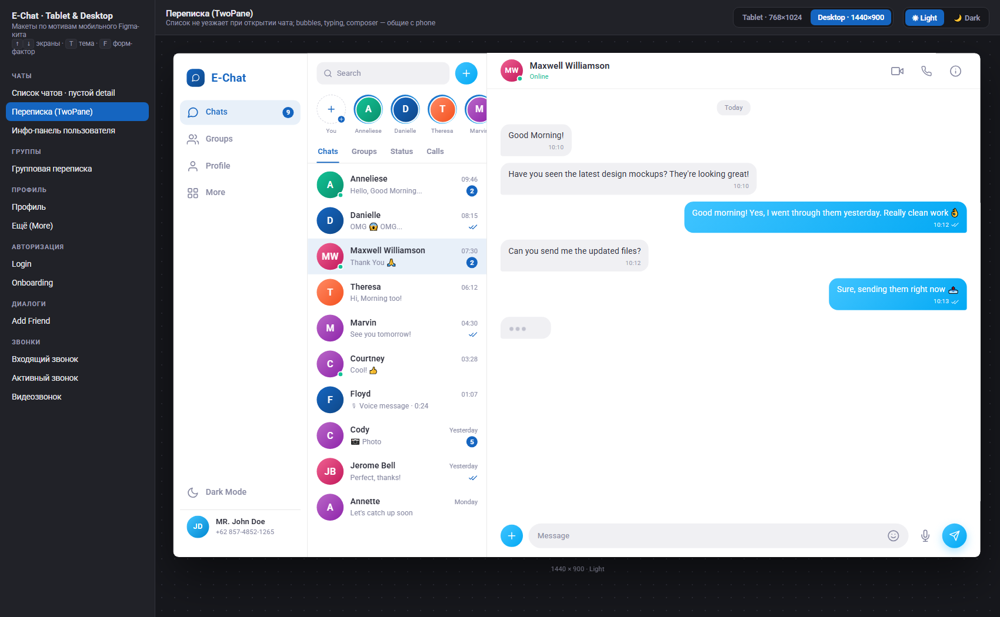 | 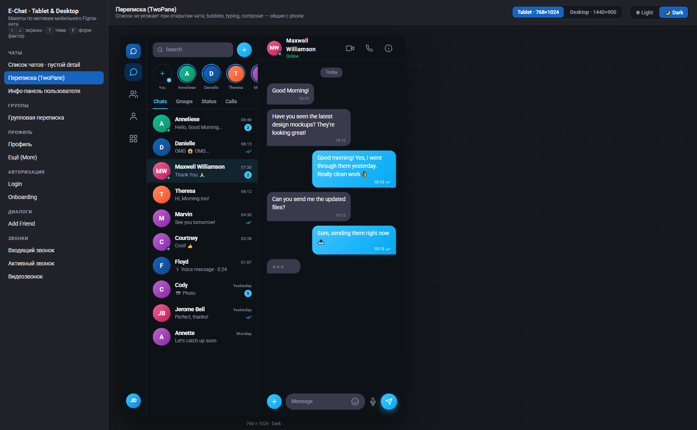 |
| 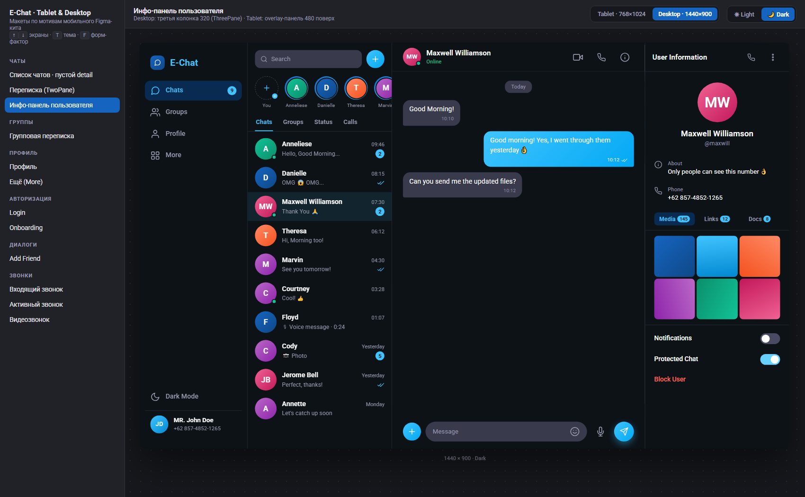 | 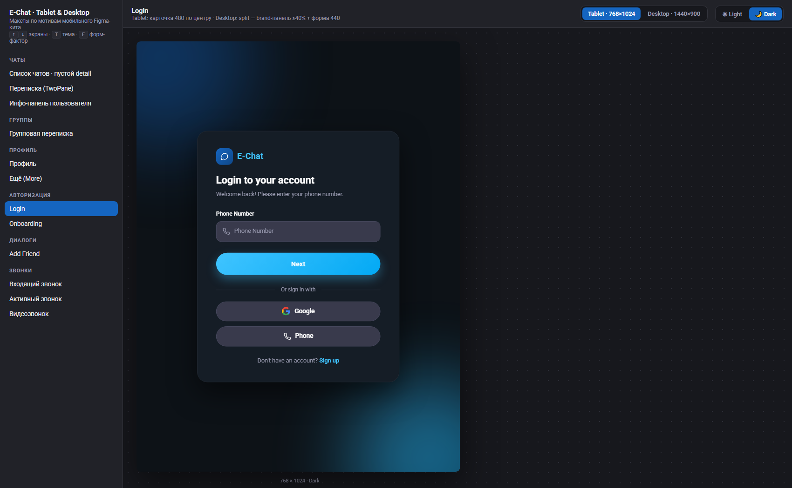 |
| 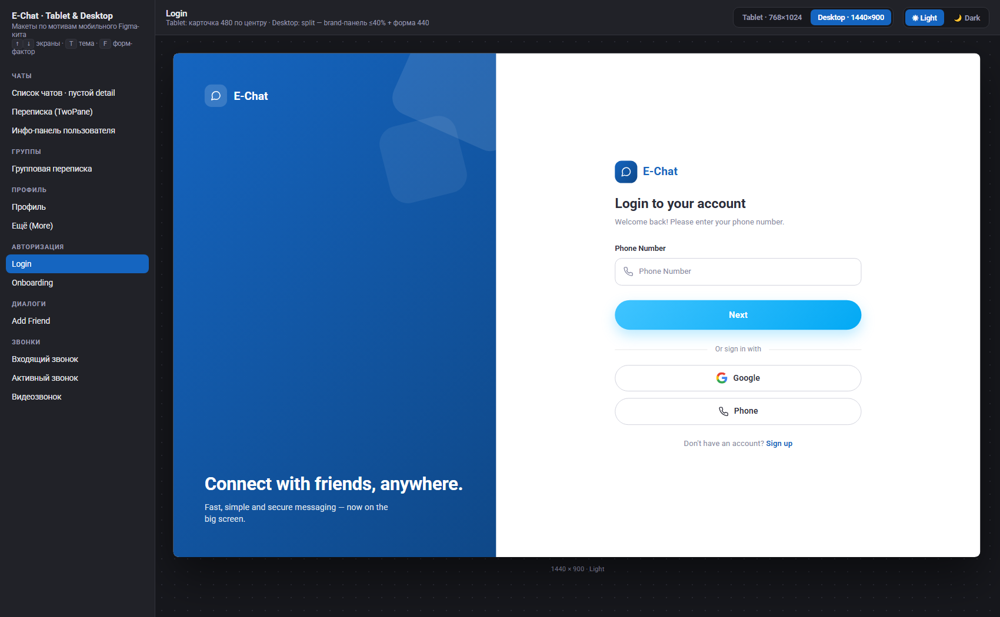 | 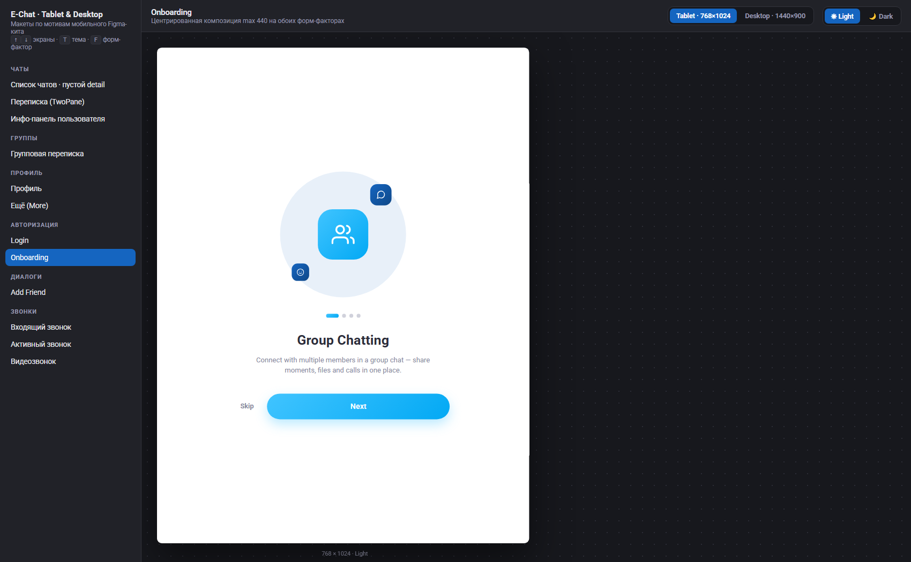 |
| 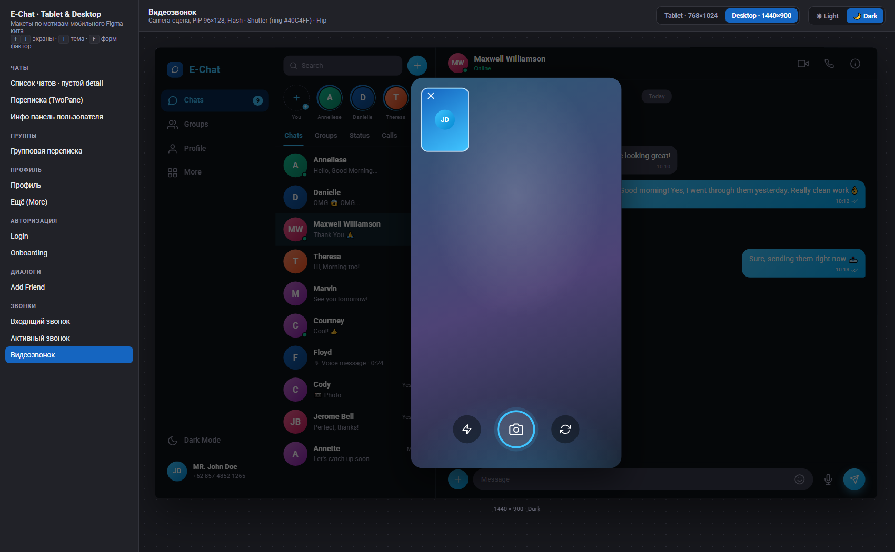 | 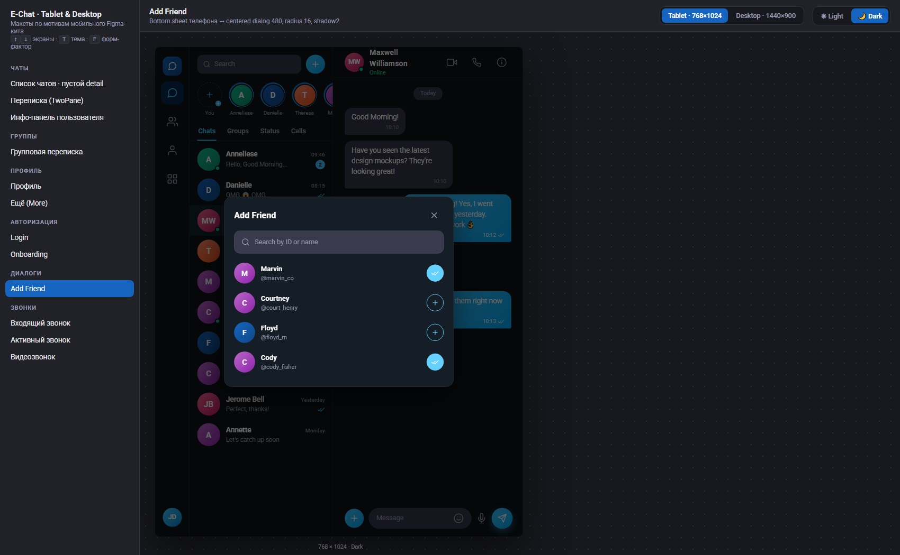 |

**Tablet landscape 1024×768** (ширина 1024 ≥ брейкпоинта desktop → sidebar вместо rail, ThreePane недоступен):

| Chats · Light | Info overlay · Light | Auth split · Dark | Видеозвонок · Dark |
| --- | --- | --- | --- |
| 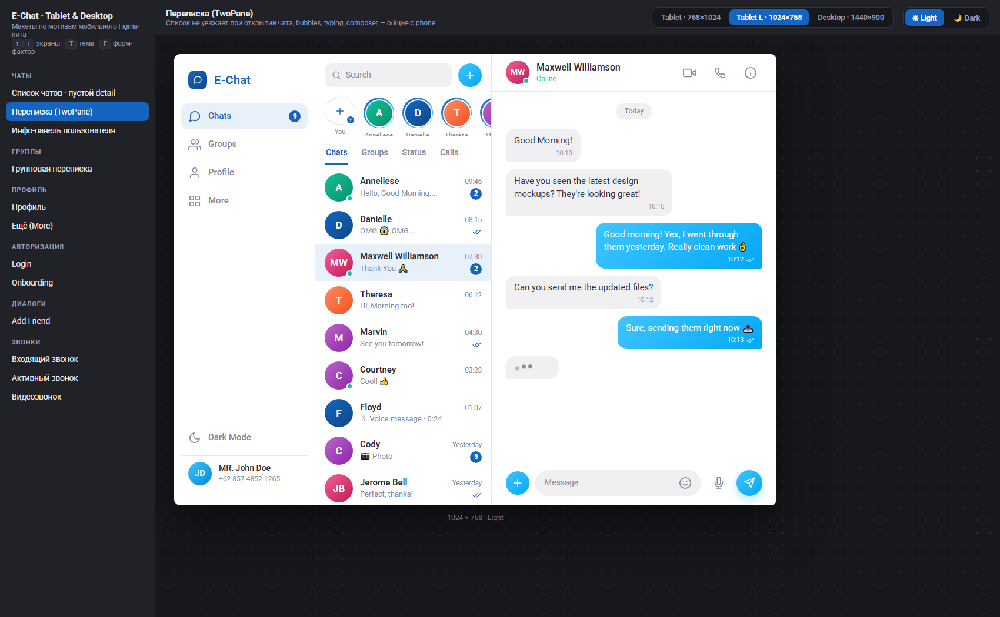 | 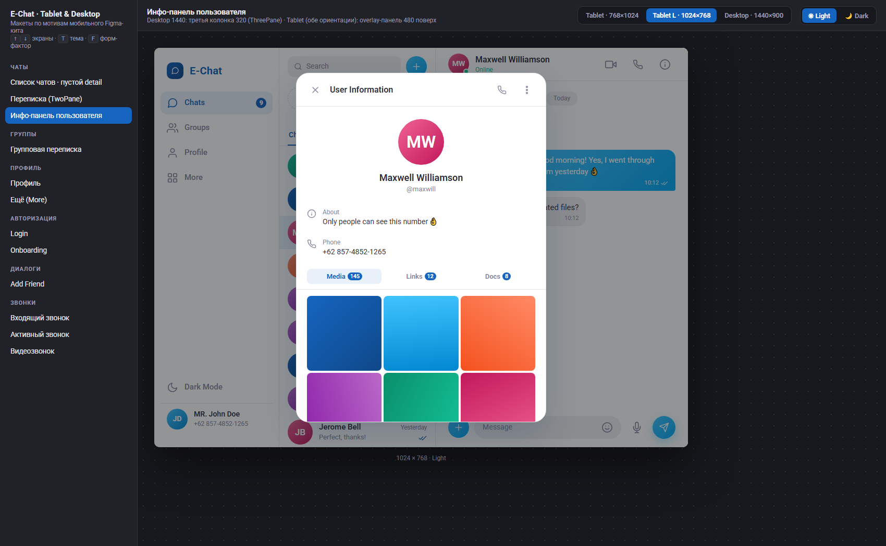 | 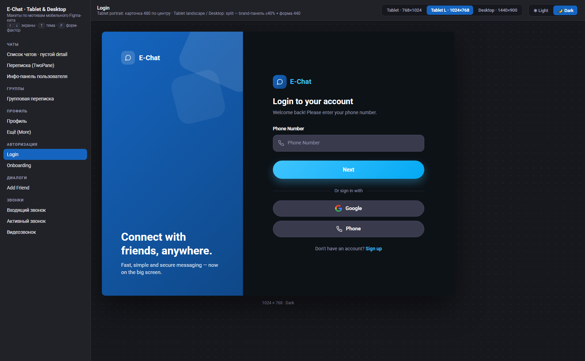 | 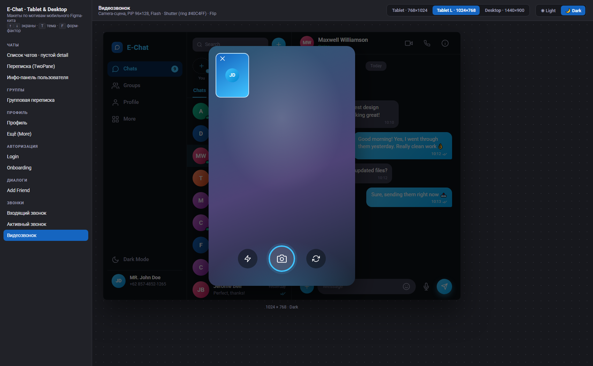 |

Остальные превью — в папке [preview/](./preview).

---

## 1. Форм-факторы и композиция

| | Phone (`<600`) | Tablet (`600–1023`) | Tablet landscape (1024) | Desktop (`≥1024`) |
| --- | --- | --- | --- | --- |
| Фрейм макета | 393×852 (Figma) | **768×1024** | **1024×768** | **1440×900** |
| Chrome | bottom bar | **NavigationRail 72** (icon-only) | **Sidebar 240**¹ | **Sidebar 240** (icon + label) |
| Chats | одна колонка | **TwoPane**: master 300 + detail flex | **TwoPane**: master 300 + detail 484 | **TwoPane**: master 320 + detail flex; **ThreePane**: + info 320 |
| Info pane | push-экран | overlay 480 | overlay 480 (три колонки не влезают: 240+320+320=880) | третья колонка 320 |
| Profile / More | full width | контент в `MaxWidthBox` 560 по центру | то же | то же |
| Auth | full width | карточка **480** по центру | **split**: brand ≤40% + форма 440 | **split** |
| Sheets | bottom sheet | centered dialog **480**, radius 16, shadow2 | то же | то же |
| Звонки | full screen | full-frame overlay | панель **420×min(780, H−80)** | панель **420×780** поверх dim shell |

¹ Ширина 1024 уже за брейкпоинтом desktop (`≥1024`) — отсюда sidebar вместо rail. При необходимости sidebar схлопывается в rail 72 (`TSizes.railWidth`).

Плотность (density) wide-версий: тайл диалога **64 dp** (на phone ~72), горизонтальный padding списка 16, переписки — 24.

## 2. Токены (без изменений палитры кита)

Новых цветов не введено — только `ColorScheme` из `docs/echat_colors.dart`:

| Роль | Light | Dark |
| --- | --- | --- |
| Surface | `#FFFFFF` | `#0D1217` |
| On surface / variant | `#2C2D3A` / `#8688A1` | `#FFFFFF` / `#9A9BB1` |
| Primary | `#1565C0` | `#40C4FF` |
| Исходящий bubble | градиент `#40C4FF→#03A9F4` | тот же |
| Входящий bubble | `#F0F0F3` | `#393A4C` |
| Unread badge | `#1565C0` | `#40C4FF` |
| Online | `#13C296` | `#13C296` |
| Accept / End (звонки) | `#00C853` / `#F44336` | те же |

Типографика — Roboto: Headline L 32/Bold, Headline M 24/SemiBold, Title L 18/SemiBold, Body L 16, Body M 14, Label L 16/SemiBold. Базовые кегли на wide не увеличиваются.

## 3. Карта экранов (12 экранов × 3 форм-фактора × 2 темы = 72 состояния)

| # | Экран | Мобильный источник (Figma PNG) | Композиция на wide |
| --- | --- | --- | --- |
| 1 | Чаты · пустой detail | `Chats.png` | master + placeholder «Select a chat» |
| 2 | Чаты · переписка | `Chats _ Conversation.png`, `… _ Typing.png` | TwoPane, список не уезжает |
| 3 | Чаты · инфо-панель | `Chats _ User Information.png`, `… _ Media.png` | Desktop: 3-я колонка 320 · Tablet: overlay 480 |
| 4 | Группы · переписка | `Groups _ Conversation.png` | TwoPane; отправители цветом, карточка документа |
| 5 | Профиль | `Profile.png` | одна колонка, MaxWidthBox 560 |
| 6 | Ещё (More) | `More.png` | MaxWidthBox 560, полное меню |
| 7 | Login | `Login _ Empty.png` | Tablet: карточка 480 · Desktop: split |
| 8 | Onboarding | `Introduce _ Step 1.png` | центрированная композиция 440 |
| 9 | Add Friend | `Add Function _ Add Friend.png` | bottom sheet → centered dialog 480 |
| 10 | Входящий звонок | `Chats _ Call.png` | Tablet: full overlay · Desktop: панель 420×780 |
| 11 | Активный звонок | `Chats _ Calling.png` | то же; таймер, Mute/Speaker/End |
| 12 | Видеозвонок | `Chats _ Video Calling.png` | то же; PiP, Flash/Shutter/Flip |

Аватары в макетах — градиентные плейсхолдеры с инициалами (в ките аватары пользователей также рисуются градиентами, см. `Add Function _ Add Friend.png`). Сцена камеры в видеозвонке — абстрактный градиент-заглушка.

## 4. Соответствие коду Flutter

| Макет | Реализация |
| --- | --- |
| Breakpoints / форм-фактор | `appBreakpointProvider` (phone / tablet / desktop) |
| Chrome | `nav_shell.dart`: `TBottomNavBar` → `TNavigationRail` / sidebar |
| Two / Three pane | `shared/layouts/two_pane.dart`, `three_pane.dart` |
| Ширины колонок | `TSizes.railWidth` (72), `sidebarWidth` (240), `masterPaneWidth` (300/320), `infoPaneWidth` (320) |
| Одноколоночные экраны | `MaxWidthBox` 560 / `TSizes.maxContentWidth` |
| Диалоги | phone bottom sheet → `showDialog` max 480 на wide |
| Звонки | full-frame overlay (tablet) / centered dialog 420×780 (desktop) |

Отдельных копий фич «под tablet/desktop» не заводить: smart-экран выбирает композицию по `appBreakpointProvider`, dumb-компоненты общие.

## 5. Файлы

| Файл | Назначение |
| --- | --- |
| `index.html` | Просмотрщик: список экранов, переключатели форм-фактора/темы, масштабирование |
| `tokens.css` | Токены Light/Dark (зеркало `echat_colors.dart`) + стили компонентов |
| `screens.js` | Рендер-функции 12 экранов + реестр |
