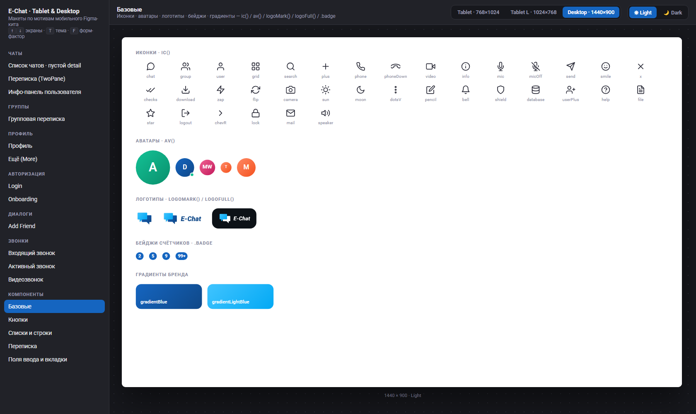
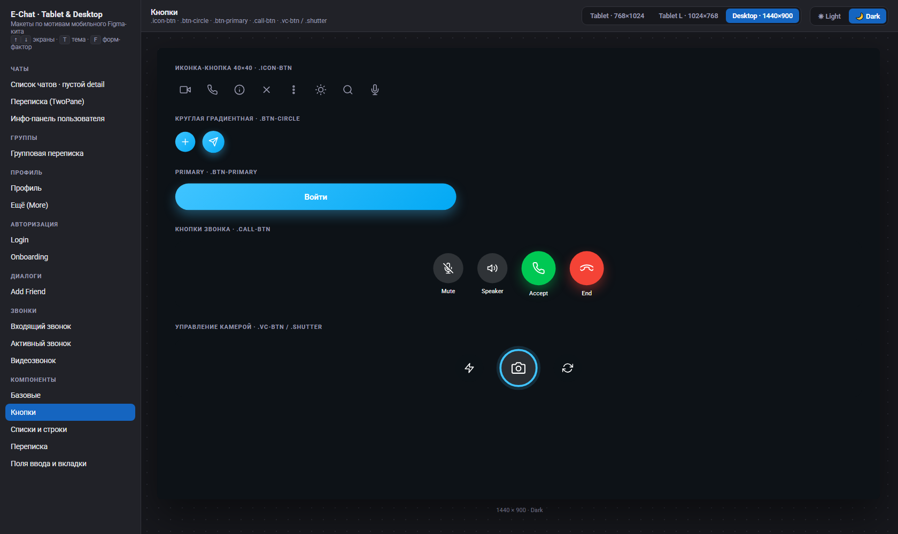
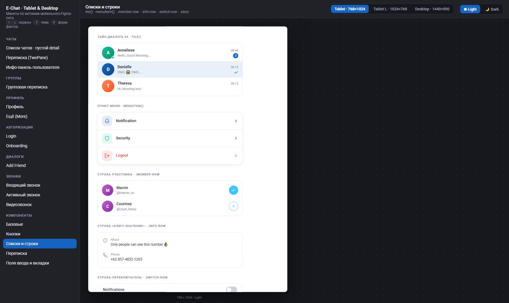
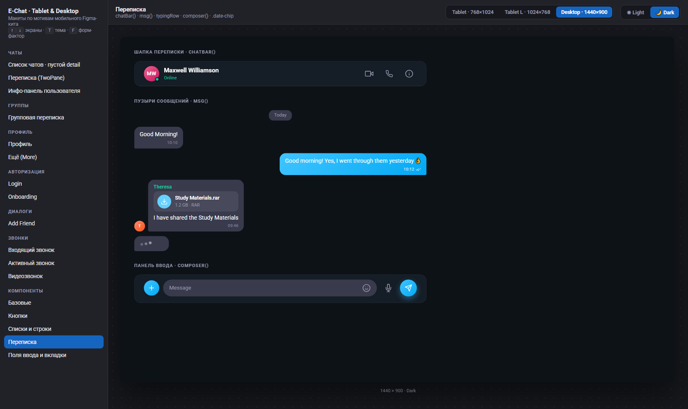
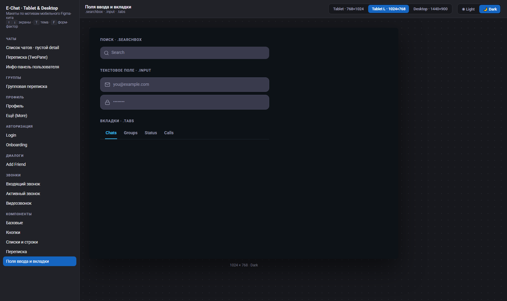

# E-Chat — макеты Tablet & Desktop

Адаптация мобильного UI-кита [Chatting App UI Kit | E-Chat (Figma)](https://www.figma.com/design/Do69JP5vfRzBNw3OO2jRHH/Chatting-App-UI-Kit-Design-_-E-Chat-_-Figma--Community-) на планшет и десктоп.

**Просмотр:** открыть [index.html](./index.html) в браузере. Переключатели в тулбаре — форм-фактор (Tablet 768×1024 / **Tablet L 1024×768** / Desktop 1440×900) и тема (Light / Dark). Горячие клавиши: `↑`/`↓` — экраны, `T` — тема, `F` — форм-фактор. Состояние хранится в hash ссылки — можно делиться конкретным экраном.

**Источники мобильного кита:** PNG-экспорт фреймов — [docs/E-Chat _ Figma/](../E-Chat%20_%20Figma).  
**Связанные документы:** спецификация раскладок — [docs/layouts-tablet-desktop.md](../layouts-tablet-desktop.md), токены — [docs/echat_colors.dart](../echat_colors.dart), архитектура адаптива — [docs/architecture_echat.md §4](../architecture_echat.md).

## Превью

| Desktop 1440×900 | Tablet 768×1024 |
| --- | --- |
|  |  |
|  |  |
|  |  |
|  |  |

**Tablet landscape 1024×768** (ширина 1024 ≥ брейкпоинта desktop → sidebar вместо rail, ThreePane недоступен):

| Chats · Light | Info overlay · Light | Auth split · Dark | Видеозвонок · Dark |
| --- | --- | --- | --- |
|  |  |  |  |

Остальные превью — в папке [preview/](./preview).

---

## 1. Форм-факторы и композиция

| | Phone (`<600`) | Tablet (`600–1023`) | Tablet landscape (1024) | Desktop (`≥1024`) |
| --- | --- | --- | --- | --- |
| Фрейм макета | 393×852 (Figma) | **768×1024** | **1024×768** | **1440×900** |
| Chrome | bottom bar | **NavigationRail 72** (icon-only) | **Sidebar 240**¹ | **Sidebar 240** (icon + label) |
| Chats | одна колонка | **TwoPane**: master 300 + detail flex | **TwoPane**: master 300 + detail 484 | **TwoPane**: master 320 + detail flex; **ThreePane**: + info 320 |
| Info pane | push-экран | overlay 480 | overlay 480 (три колонки не влезают: 240+320+320=880) | третья колонка 320 |
| Profile / More | full width | контент в `MaxWidthBox` 560 по центру | то же | то же |
| Auth | full width | карточка **480** по центру | **split**: brand ≤40% + форма 440 | **split** |
| Sheets | bottom sheet | centered dialog **480**, radius 16, shadow2 | то же | то же |
| Звонки | full screen | full-frame overlay | панель **420×min(780, H−80)** | панель **420×780** поверх dim shell |

¹ Ширина 1024 уже за брейкпоинтом desktop (`≥1024`) — отсюда sidebar вместо rail. При необходимости sidebar схлопывается в rail 72 (`TSizes.railWidth`).

Плотность (density) wide-версий: тайл диалога **64 dp** (на phone ~72), горизонтальный padding списка 16, переписки — 24.

## 2. Токены (без изменений палитры кита)

Новых цветов не введено — только `ColorScheme` из `docs/echat_colors.dart`:

| Роль | Light | Dark |
| --- | --- | --- |
| Surface | `#FFFFFF` | `#0D1217` |
| On surface / variant | `#2C2D3A` / `#8688A1` | `#FFFFFF` / `#9A9BB1` |
| Primary | `#1565C0` | `#40C4FF` |
| Исходящий bubble | градиент `#40C4FF→#03A9F4` | тот же |
| Входящий bubble | `#F0F0F3` | `#393A4C` |
| Unread badge | `#1565C0` | `#40C4FF` |
| Online | `#13C296` | `#13C296` |
| Accept / End (звонки) | `#00C853` / `#F44336` | те же |

Типографика — Roboto: Headline L 32/Bold, Headline M 24/SemiBold, Title L 18/SemiBold, Body L 16, Body M 14, Label L 16/SemiBold. Базовые кегли на wide не увеличиваются.

## 3. Карта экранов (13 экранов × 3 форм-фактора × 2 темы = 78 состояний)

| # | Экран | Мобильный источник (Figma PNG) | Композиция на wide |
| --- | --- | --- | --- |
| 1 | Чаты · пустой detail | `Chats.png` | master + placeholder «Select a chat» |
| 2 | Чаты · переписка | `Chats _ Conversation.png`, `… _ Typing.png` | TwoPane, список не уезжает |
| 3 | Чаты · инфо-панель | `Chats _ User Information.png`, `… _ Media.png` | Desktop: 3-я колонка 320 · Tablet: overlay 480 |
| 4 | Группы · переписка | `Groups _ Conversation.png` | TwoPane; отправители цветом, карточка документа |
| 5 | Профиль | `Profile.png` | одна колонка, MaxWidthBox 560 |
| 6 | Ещё (More) | `More.png` | MaxWidthBox 560, полное меню |
| 7 | Login (email + пароль) | `Login _ Empty.png` | Tablet: карточка 480 · Desktop: split; вход по email и паролю, без соцкнопок |
| 7a | Login · отправка формы | — | то же; поля disabled, на кнопке спиннер вместо лейбла (`TButtons` `isLoading`) |
| 8 | Onboarding | `Introduce _ Step 1.png` | центрированная композиция 440 |
| 9 | Add Friend | `Add Function _ Add Friend.png` | bottom sheet → centered dialog 480 |
| 10 | Входящий звонок | `Chats _ Call.png` | Tablet: full overlay · Desktop: панель 420×780 |
| 11 | Активный звонок | `Chats _ Calling.png` | то же; таймер, Mute/Speaker/End |
| 12 | Видеозвонок | `Chats _ Video Calling.png` | то же; PiP, Flash/Shutter/Flip |

Аватары в макетах — градиентные плейсхолдеры с инициалами (в ките аватары пользователей также рисуются градиентами, см. `Add Function _ Add Friend.png`). Сцена камеры в видеозвонке — абстрактный градиент-заглушка.

## 4. Переиспользуемые компоненты

Компоненты, встречающиеся в макетах более одного раза. В `screens.js` они уже вынесены в хелперы (колонка «Макет»); колонка «Flutter» — целевой общий виджет по соглашениям проекта (класс `T*`, файл `t_*.dart`). Отдельных копий «под форм-фактор» не заводить — параметризация через props и `appBreakpointProvider`.

**Живой просмотр:** все компоненты собраны в просмотрщике [index.html](./index.html) — группа **«Компоненты»** в списке экранов (5 галерей: Базовые, Кнопки, Списки и строки, Переписка, Поля ввода и вкладки). Тема и форм-фактор переключаются общими контролами тулбара.

| Базовые · Desktop · Light | Кнопки · Desktop · Dark | Списки · Tablet · Light |
| --- | --- | --- |
|  |  |  |
| **Переписка · Desktop · Dark** | **Поля и вкладки · Tablet L · Dark** | |
|  |  | |

### Базовые

| Компонент | Макет | Где используется | Flutter |
| --- | --- | --- | --- |
| Иконка outline 24×24 | `ic()` / `.ic` | все 12 экранов (~47 вызовов) | набор глифов `TAppIcons` (SVG-assets) |
| Аватар: градиент, инициалы, online-dot | `av()` / `.av`, `.dot` | 10 экранов: chrome, tile, chat-bar, bubble (группы), info-pane, profile, more, add-friend, звонки, PiP | `TAvatar` (`t_avatar.dart`) |
| Логотип: знак / знак + wordmark, версии под тему | `logoMark()`, `logoFull()` / `.logo-img` | rail, sidebar, auth (brand + форма), empty-detail | `TLogo` (`t_logo.dart`) |
| Бейдж счётчика (unread) | `.badge` (+ `.cnt` в media-tabs) | sidebar, тайл диалога, media-tabs | `TCountBadge` (`t_count_badge.dart`) |

### Кнопки

| Компонент | Макет | Где используется | Flutter |
| --- | --- | --- | --- |
| Иконка-кнопка 40×40 | `.icon-btn` | chat-bar, info-head, single-head, dialog-head, video-top (12 вхождений) | `TIconButton` (`t_icon_button.dart`) |
| Круглая градиентная (plus / send) | `.btn-circle.grad-light-blue` | master-head, composer ×2 | `TGradientButton` (`t_gradient_button.dart`) |
| Primary (градиент, pill) | `.btn-primary` | login, onboarding | `TPrimaryButton` (`t_primary_button.dart`) |
| Primary · загрузка (спиннер вместо лейбла, геометрия сохраняется) | `.btn-primary.loading` + `.spinner` | login · отправка формы | `TButtons` (`t_buttons.dart`) — проп `isLoading` |
| Кнопка звонка (Mute/Speaker/Accept/End) | `.call-btn` | входящий и активный звонок | `TCallButton` (`t_call_button.dart`) |

### Навигация и вкладки

| Компонент | Макет | Где используется | Flutter |
| --- | --- | --- | --- |
| Chrome: rail 72 / sidebar 240 + пункты `.dest` | `chrome()` / `.rail`, `.sidebar` | chats ×3, groups, profile, more (+ подложка диалогов и звонков) | `nav_shell.dart`: `TNavigationRail` / sidebar |
| Вкладки списка (Chats/Groups/Status/Calls) | `.tabs`, `.tab` | master чатов и групп | `TTabs` (`t_tabs.dart`) |

### Списки и строки

| Компонент | Макет | Где используется | Flutter |
| --- | --- | --- | --- |
| Тайл диалога 64 dp (аватар, имя, превью, время, бейдж/ticks) | `tile()` / `.tile` | master чатов (×10) и групп (×5) | `TChatListTile` (`t_chat_list_tile.dart`) |
| Пункт меню с цветной «плиткой» иконки | `menuItem()` / `.menu-item`, `.sq` | profile ×4, more ×11 | `TMenuItem` (`t_menu_item.dart`) |

### Переписка

| Компонент | Макет | Где используется | Flutter |
| --- | --- | --- | --- |
| Шапка переписки (аватар, имя, статус, действия) | `chatBar()` / `.chat-bar` | chats ×2, groups | `TChatBar` (`t_chat_bar.dart`) |
| Пузырь сообщения (in/out, sender, meta, ticks) | `msg()` / `.msg-row`, `.bubble` | chats ×2, groups (12 сообщений) | `TChatBubble` (`t_chat_bubble.dart`) |
| Индикатор набора текста | `typingRow` / `.typing` | chats, groups | `TTypingIndicator` (`t_typing_indicator.dart`) |
| Панель ввода (plus, поле, mic, send) | `composer()` / `.composer`, `.msgfield` | chats ×2, groups | `TComposer` (`t_composer.dart`) |
| Чип даты в ленте | `.date-chip` | chats ×2, groups | `TDateChip` (`t_date_chip.dart`) |

### Поля ввода

| Компонент | Макет | Где используется | Flutter |
| --- | --- | --- | --- |
| Поиск (filled, pill) | `.searchbox` | master чатов и групп | `TSearchField` (`t_search_field.dart`) |
| Текстовое поле с иконкой (outlined) | `.input` | login (email, пароль), add-friend (поиск) | `TTextField` (`t_text_field.dart`) |

### Контейнеры и каркасы

| Компонент | Макет | Где используется | Flutter |
| --- | --- | --- | --- |
| Master-колонка списка (search + stories + tabs + tiles) | `master()` / `.master` | chats ×3 (groups — вариация без stories) | master-панель `shared/layouts/two_pane.dart` |
| Модальный паттерн: dim + centered dialog 480 | `.overlay` + `.dialog` | info-pane (tablet), add-friend, панель звонка | `showDialog` 480 (§1) + каркас `TAppDialog` (`t_app_dialog.dart`) |
| Каркас звонка: full overlay / панель 420×780 | `.call-full` / `.call-panel`, `.call-body`, `.call-controls` | все 3 экрана звонков | `TCallScaffold` (`t_call_scaffold.dart`) |
| Градиенты бренда | `.grad-blue`, `.grad-light-blue` | auth brand, btn-primary, bubble out, btn-circle, story ring, logo-badge | токены темы (`TGradients` в `utils/theme`) |

### Повторы внутри одного экрана

Встречаются более одного раза, но пока на одном экране — тоже оформлять компонентами, а не копипастой:

| Компонент | Макет | Экран | Flutter |
| --- | --- | --- | --- |
| Сторис (ring + подпись, вариант «add») | `.story` | chats master ×6 | `TStoryItem` (`t_story_item.dart`) |
| Строка участника + кнопка add/added | `.member-row`, `.add-btn` | add-friend ×4 | `TMemberRow` (`t_member_row.dart`) |
| Строка «ключ-значение» с иконкой | `.info-row` | info-pane ×2 | `TInfoRow` (`t_info_row.dart`) |
| Строка-переключатель | `.switch-row`, `.tgl` | info-pane ×2 (+ danger-вариант) | `TSwitchRow` (`t_switch_row.dart`) |
| Цветной бейдж с иконкой | `.logo-badge` | onboarding ×3 | `TLogoBadge` (`t_logo_badge.dart`) |
| Круглая кнопка управления камерой | `.vc-btn` | видеозвонок ×2 | `TVideoControlButton` (`t_video_control_button.dart`) |

### Примечания

- **Одноразовые** (ровно 1 экран/вызов — не выносить в shared до второго использования): `.btn-tonal` (Edit Profile), `.empty-detail`, `.doc-card`, `.profile-card`, `.profile-strip`, `.shutter`, `.onb .dots`, `.media-tabs` + `.media-grid`, `.pip`.
- **Мёртвые стили** в `tokens.css` (не используются в `screens.js`, наследие убранных соцкнопок): `.btn-outline`, `.divider-or`, `.avatar-mini`, `.menu-item .chev` — кандидаты на удаление.

## 5. Соответствие коду Flutter

| Макет | Реализация |
| --- | --- |
| Breakpoints / форм-фактор | `appBreakpointProvider` (phone / tablet / desktop) |
| Chrome | `nav_shell.dart`: `TBottomNavBar` → `TNavigationRail` / sidebar |
| Two / Three pane | `shared/layouts/two_pane.dart`, `three_pane.dart` |
| Ширины колонок | `TSizes.railWidth` (72), `sidebarWidth` (240), `masterPaneWidth` (300/320), `infoPaneWidth` (320) |
| Одноколоночные экраны | `MaxWidthBox` 560 / `TSizes.maxContentWidth` |
| Диалоги | phone bottom sheet → `showDialog` max 480 на wide |
| Звонки | full-frame overlay (tablet) / centered dialog 420×780 (desktop) |

Отдельных копий фич «под tablet/desktop» не заводить: smart-экран выбирает композицию по `appBreakpointProvider`, dumb-компоненты общие.

## 6. Файлы

| Файл | Назначение |
| --- | --- |
| `index.html` | Просмотрщик: список экранов, переключатели форм-фактора/темы, масштабирование |
| `tokens.css` | Токены Light/Dark (зеркало `echat_colors.dart`) + стили компонентов |
| `screens.js` | Рендер-функции 12 экранов + 5 галерей компонентов (§4) + реестр |

Логотипы в макетах — файлы из [assets/logos/](../../assets/logos): `logo_echat_light/dark.png` (знак + wordmark, 465×158) в сайдбаре и на экране авторизации, `logo_light/dark.png` (знак, 174×158) в rail и empty-state. Версия под тему переключается классами `logo-l` / `logo-d` (см. `tokens.css`).
