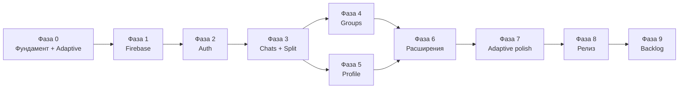

# Roadmap — E-Chat (flutter_echat)

План разработки мессенджера по UI-киту [Figma E-Chat](https://www.figma.com/design/Do69JP5vfRzBNw3OO2jRHH/Chatting-App-UI-Kit-Design-_-E-Chat-_-Figma--Community-), архитектуре [architecture.md](./architecture.md) и схеме [firebase-database.md](./firebase-database.md).

**Целевые форм-факторы:** phone · tablet (≥600 dp) · desktop / wide (≥1024 dp: Windows, macOS, Linux, web).

**UI-паттерн:** smart / dumb ([architecture.md §3](./architecture.md#3-умный--глупый-компонент)) — один Notifier на экран, разные layout-композиции глупых виджетов.

**Ошибки:** все через sealed `Failure` ([architecture.md §10](./architecture.md#10-ошибки-и-result)); `String` / `Option<String>` для ошибок не используются — только `Failure.displayMessage`.

**Легенда:** `[ ]` — не начато · `[~]` — в работе · `[x]` — готово

---

## Обзор фаз

| Фаза | Название | Результат |
| --- | --- | --- |
| 0 | Фундамент | Структура, стек, adaptive shell, smart/dumb каркас |
| 1 | Firebase & Core | Подключён Firebase, core-слой, rules |
| 2 | Auth & Onboarding | Splash → Login → OTP → Profile setup (все ширины) |
| 3 | Chats MVP | Список + переписка 1:1; phone stack / tablet–desktop master–detail |
| 4 | Groups | Группы + split view на wide |
| 5 | Profile & More | Профиль, настройки; constrained layout на desktop |
| 6 | Расширения | Звонки, push, typing, медиа, block/report |
| 7 | Adaptive polish & multi-platform | Desktop chrome, keyboard, resize, golden по breakpoints |
| 8 | Релиз | Тесты, polish, store / desktop distribuция |
| 9 | Backlog | COMING SOON из Figma |

---

## Фаза 0 — Фундамент

**Цель:** подготовить репозиторий и каркас приложения без бизнес-логики, сразу с adaptive и smart/dumb.

### 0.1. Зависимости и codegen

- [ ] Добавить в `pubspec.yaml`: `flutter_riverpod`, `riverpod_annotation`, `freezed_annotation`, `json_annotation`, `fpdart`
- [ ] Dev: `riverpod_generator`, `freezed`, `build_runner`, `json_serializable`, `riverpod_lint`, `custom_lint`
- [ ] Настроить `analysis_options.yaml` (riverpod_lint)
- [ ] Проверить: `dart run build_runner build --delete-conflicting-outputs`
- [ ] Включить desktop targets: `flutter create --platforms=windows,macos,linux` (по необходимости) + web

### 0.2. Структура `lib/`

- [ ] Создать `lib/app/` (`app.dart`, заготовка router)
- [ ] Создать `lib/app/adaptive/` — `AppBreakpoint`, `appBreakpointProvider`, helpers
- [ ] Создать `lib/core/error/failures.dart` (Freezed sealed `Failure`)
- [ ] Создать `lib/shared/widgets/` (dumb-заглушки) и `lib/shared/layouts/` (`TwoPane`, `MaxWidthBox`)
- [ ] Создать папки features: `onboarding`, `auth`, `chats`, `groups`, `profile`, `more`
- [ ] В каждом feature presentation: соглашение `*_screen.dart` (smart) + `*_view.dart` (dumb)

### 0.3. UI / Design system (dumb)

- [ ] Перенести цвета E-Chat из Figma (Blue `#1565C0`, Light Blue `#40C4FF`, …)
- [ ] Подключить шрифт **Roboto** (Google Fonts)
- [ ] Базовые **dumb**-компоненты: `EChatButton`, `EChatTextField`, `EChatAppBar`, `EChatAvatar`
- [ ] Тема Light / Dark (экран More → Dark Mode)
- [ ] Density / spacing tokens с учётом desktop (чуть плотнее списки, `maxContentWidth`)

### 0.4. Навигация и adaptive shell

- [ ] Выбрать router (`go_router` или `auto_route`)
- [ ] **Phone:** Shell с нижней навигацией — Chats | Groups | Profile | More
- [ ] **Tablet / Desktop:** Shell с `NavigationRail` / sidebar (те же 4 раздела)
- [ ] Общие маршруты; shell выбирает chrome по `appBreakpointProvider`
- [ ] Заготовки auth flow (guard: неавторизован → login)
- [ ] Заготовка master–detail слота для `/chats` и `/groups` (wide)

### 0.5. Конвенции smart / dumb

- [ ] Документировать в коде/README feature: smart не содержит тяжёлую вёрстку; dumb не импортирует Riverpod
- [ ] Пример-эталон: один screen + view (например, заглушка ChatList)

---

## Фаза 1 — Firebase & Core

**Цель:** Firebase работает, rules задеплоены, core ready.

> Инструкции: [firebase-flutter-connect.md](./firebase-flutter-connect.md), [firebase-setup.md](./firebase-setup.md), [firebase-events.md](./firebase-events.md)

### 1.1. Подключение Flutter

- [ ] `flutterfire configure` (Android + iOS; при необходимости Windows / macOS / web)
- [ ] `Firebase.initializeApp` + `ProviderScope` в `main.dart`
- [ ] Android: Google Services plugin, `minSdk 23`
- [ ] iOS: `pod install`, проверка `GoogleService-Info.plist`
- [ ] Desktop/web: проверить поддерживаемые Firebase-плагины; fallback-план для Auth/Storage где SDK ограничен

### 1.2. Firebase Console

- [ ] Создать проект Firebase
- [ ] Включить **Authentication → Phone**
- [ ] Создать **Firestore** (production mode)
- [ ] Создать **Realtime Database**
- [ ] Создать **Storage**
- [ ] Добавить тестовые номера OTP (dev)

### 1.3. Rules & indexes

- [ ] `firebase/firestore.rules` — по [firebase-setup.md](./firebase-setup.md)
- [ ] `firebase/firestore.indexes.json`
- [ ] `firebase/database.rules.json` (`/status`, `/typing`)
- [ ] `firebase/storage.rules`
- [ ] `firebase deploy --only firestore:rules,firestore:indexes,database,storage`

### 1.4. Core providers

- [ ] `@Riverpod(keepAlive)` — `firebaseAuthProvider`
- [ ] `@Riverpod(keepAlive)` — `firestoreProvider`
- [ ] `@Riverpod(keepAlive)` — `firebaseDatabaseProvider`
- [ ] `@Riverpod(keepAlive)` — `firebaseStorageProvider`
- [ ] `FirestorePaths` — константы коллекций ([firebase-database.md §4](./firebase-database.md))

### 1.5. Cloud Functions (минимум)

- [ ] Init `functions/` (TypeScript)
- [ ] `onUserCreate` → документ `userSettings/{uid}`
- [ ] `onMessageCreate` → `chats.lastMessage`, increment `unreadCount`
- [ ] Deploy functions (Blaze plan)

---

## Фаза 2 — Auth & Onboarding

**Цель:** пользователь проходит путь из Figma: Loading → Introduce → Login/Sign Up → OTP → User Information → Security setup. На wide — центрированные формы (`MaxWidthBox`), без дублирования логики.

### 2.1. Feature `onboarding`

- [ ] **Loading** (_Start, _Middle, _Done) — smart screen + dumb views; `SharedPreferences.onboardingSeen`
- [ ] **Introduce Step 1–4** — PageView (Group Chatting, Video/Voice, Encryption, Cross-Platform)
- [ ] Кнопки Skip / Next / Get started
- [ ] На desktop: ограничить ширину карусели; сохранить те же dumb-страницы
- [ ] После завершения → Login

### 2.2. Feature `auth` — domain & data

- [ ] Entity: `AuthUser`, `PhoneAuthSession`
- [ ] `AuthRepository` interface → `Either<Failure, T>`
- [ ] `AuthRemoteDataSource` — Firebase Phone Auth
- [ ] `UserRemoteDataSource` — CRUD `users/{uid}`
- [ ] DTO: `UserDto` + маппинг в entity
- [ ] `@Riverpod(keepAlive) authRepositoryProvider`

### 2.3. Feature `auth` — Login / Register

- [ ] **Login _ Empty / Typing / Filled** — dumb `LoginView`; smart `LoginScreen`
- [x] **Register** — страница регистрации задокументирована в [architecture.md §3.5](./architecture.md#35-пример-страница-регистрации-auth--register): фича `features/auth/presentation/register/` — `RegisterScreen` (smart) + `RegisterView` (dumb) + `RegisterController` (`@riverpod`) + `RegisterState` (Freezed)
- [ ] **Register UI** — реализация полей Name / Phone / Password, чекбокс Terms, кнопка Register; `submit()` → `authRepository.register(...)` → `/otp`
- [ ] Checkbox **Remember me** → `SharedPreferences`
- [ ] `LoginController` (@riverpod Notifier) + `LoginState` (Freezed) — один на все ширины
- [ ] `verifyPhoneNumber` → переход на OTP
- [ ] Wide: форма в колонке с max-width, не full-bleed phone layout

### 2.4. Feature `auth` — OTP

- [ ] **OTP Empty / Filled / Error / Resent Code** — `OtpScreen` (smart) + `OtpView` (dumb)
- [ ] `OtpController` + `OtpState` (Freezed, ошибка через sealed `Failure`)
- [ ] `signInWithCredential` → успех / Code Invalid

### 2.5. Feature `auth` — User Information

- [ ] **Sign Up _ User Information** — имя + аватар (dumb form)
- [ ] Загрузка аватара → Storage `avatars/{uid}/`
- [ ] Создание `users/{uid}` (displayName, phone, eChatPublicId, …)
- [ ] Redirect → Security setup или Home

### 2.6. Feature `security` (локально)

- [ ] **Set Face ID / Touch ID / PIN Security** — UI по Figma; на desktop — PIN (biometrics по платформе)
- [ ] `flutter_secure_storage` — PIN (не в Firestore)
- [ ] Флаги `faceIdEnabled`, `touchIdEnabled`, `pinEnabled` в `users`
- [ ] **Setting _ Notification** — запрос разрешения FCM / OS notifications
- [ ] Создание `userSettings/{uid}` (defaults)

### 2.7. Auth guard

- [ ] Stream `authStateChanges` → `@riverpod` `currentUserProvider`
- [ ] Router redirect: нет user → `/login`; есть user без profile → `/signup/profile`

---

## Фаза 3 — Chats MVP (1:1)

**Цель:** вкладка **Chats** — список, поиск, переписка, добавление друга. Phone: stack navigation. Tablet/Desktop: master–detail из одних dumb-view.

### 3.1. Feature `chats` — domain & data

- [ ] Entities: `Chat`, `ChatMember`, `Message`, enums `MessageType`, `MessageStatus`
- [ ] `ChatRepository`: `watchChats`, `watchMessages`, `sendMessage`, `getOrCreateDirectChat`
- [ ] DTO: `ChatDto`, `MessageDto`, `MemberDto`
- [ ] `ChatRemoteDataSource` (Firestore)
- [ ] `TypingRemoteDataSource` (RTDB `/typing/{chatId}/{uid}`)
- [ ] `PresenceRemoteDataSource` (RTDB `/status/{uid}`)

### 3.2. Список чатов

- [ ] **Chats** — `ChatListScreen` (smart) + `ChatListView` (dumb): last message, time, unread
- [ ] `chatListStreamProvider` (`@riverpod Stream<Either<Failure, List<Chat>>>`) + `ChatListController` (AsyncNotifier, подписка через `ref.watch` / `ref.onDispose`) — один на все форм-факторы
- [ ] Pull-to-refresh (phone/tablet); на desktop — refresh action / focus shortcut
- [ ] **Chats _ Click Search** — фильтрация по имени locally
- [ ] **Chats _ Click Add** → меню Add Friend / Create Group

### 3.3. Add Friend

- [ ] **Add Function _ Add Friend** — поиск по телефону / имени (dumb dialog/page)
- [ ] **Add Friend _ Searching** — debounce query
- [ ] `ContactRepository` + запись `contacts/{ownerId_peerId}`
- [ ] Создание direct chat при первом сообщении
- [ ] Wide: modal/dialog вместо full-screen где уместно

### 3.4. Экран переписки

- [ ] **Chats _ Conversation** — `ChatThreadScreen` + `ChatThreadView` (reverse list)
- [ ] Пузырьки incoming/outgoing, timestamp, status (sent/delivered/read) — shared dumb
- [ ] **Conversation _ Typing** — подписка RTDB typing
- [ ] Composer: текст + Send; на desktop — Enter = send, Shift+Enter = newline
- [ ] `ChatThreadController(chatId)` — optimistic send
- [ ] Pagination: `limit(40)` + load more

### 3.5. Adaptive shell (chats)

- [ ] `ChatsShellScreen` (smart): по breakpoint собирает layout
- [ ] Phone: list → push thread
- [ ] Tablet: `TwoPane` (list | thread), empty detail state
- [ ] Desktop: list | thread | optional info pane (заглушка до фазы 5)
- [ ] Deep link `/chats/:id` корректно открывает detail на всех ширинах
- [ ] Resize окна: сохранение `selectedChatId`, без потери scroll state где возможно

### 3.6. Shared UI (dumb)

- [ ] `ChatBubble`, `MessageStatusIcon`, `ChatListTile`
- [ ] Empty state (нет чатов / не выбран чат на wide)
- [ ] Shimmer / loading skeletons

---

## Фаза 4 — Groups

**Цель:** вкладка **Groups** — список групп, создание, group chat; тот же master–detail паттерн, что у Chats.

### 4.1. Создание группы

- [ ] **Add Function _ Create Group** — Name Group, Members (dumb form)
- [ ] **Added Members / Select Members** — multi-select контактов
- [ ] `ChatRepository.createGroup` → `chats` type `group` + `members`
- [ ] System message: «X created the group»
- [ ] Wide: dialog / side sheet вместо full-screen flow

### 4.2. Список групп

- [ ] **Groups** — отдельная вкладка (фильтр `type == group`)
- [ ] `GroupListController` (можно reuse ChatList с фильтром) + dumb `GroupListView`
- [ ] `GroupsShellScreen` — master–detail на tablet/desktop

### 4.3. Group conversation

- [ ] **Groups _ Conversation** — лента с именем отправителя (reuse `ChatThreadView` props)
- [ ] **Chats _ Group Information** — название, аватар, members (detail pane на desktop)
- [ ] **Add members to group** — обновление `participantIds` + members
- [ ] Роли: owner / admin / member (базово)

### 4.4. Group settings (User/Group Information)

- [ ] Mute Notification toggle → `members.isMuted`
- [ ] Hide Chat / Hide Chat History → `members.isHidden`, `hideHistoryAt`
- [ ] Report / Block

---

## Фаза 5 — Profile & More

**Цель:** вкладки **Profile** и **More** по Figma; на desktop — контент в `MaxWidthBox`, rail остаётся.

### 5.1. Profile

- [ ] **Profile** — `ProfileScreen` + `ProfileView`: аватар, имя, phone, eChatPublicId (copy)
- [ ] **Profile _ Edit** — изменение имени, аватара, about
- [ ] `UserRepository` + `UserController`
- [ ] **Logout** — `FirebaseAuth.signOut` + clear local state

### 5.2. More — настройки

- [ ] **More** — Language (en/ru), Dark Mode toggle, Sound
- [ ] `SettingsRepository` → `userSettings/{uid}`
- [ ] `ThemeMode` через `@riverpod` + persist в Firestore
- [ ] **Invite Friends** — share link / system share sheet (desktop: copy link fallback)
- [ ] **Security** — переход к PIN / biometrics settings
- [ ] **Help Center**, Terms, Privacy, About — static WebView или assets

### 5.3. User / Chat Information (1:1)

- [ ] **Chats _ User Information** — Media, Links & Documents, Mute, Protected Chat, Custom Color/BG
- [ ] На desktop — правая панель shell; на phone — отдельный route
- [ ] **User Information _ Media / Links / Documents** — query messages by type
- [ ] Video Call / Call buttons (→ фаза 6)

---

## Фаза 6 — Расширения

**Цель:** звонки, push, медиа, продвинутые настройки чата. Логика в Notifier/Data; UI — dumb views, встроенные в phone full-screen или desktop panes/dialogs.

### 6.1. Медиа в чате

- [ ] **Conversation _ Attachment** — picker photo/video/file (платформенный)
- [ ] Upload Storage → `chats/{chatId}/images|videos|files/`
- [ ] Message types: image, video, voice, file
- [ ] **Conversation _ Record** — голосовые (mobile-first; desktop — upload audio file)
- [ ] Превью медиа в ленте

### 6.2. Realtime

- [ ] Online / last seen в шапке чата (`/status`)
- [ ] Typing indicator (уже в 3.4 — polish)
- [ ] Read receipts (`readBy` map) + галочки UI

### 6.3. Звонки

- [ ] Entity `Call`, `CallRepository`
- [ ] **Chats _ Call / Calling / Video Calling** — smart overlay + dumb call UI
- [ ] Firestore `calls/{id}` — signaling metadata
- [ ] Интеграция WebRTC (Agora / LiveKit) — медиапоток; проверить desktop SDK
- [ ] FCM data message для входящего звонка (mobile); desktop — in-app / local notification
- [ ] **Groups _ Call / Video Calling**

### 6.4. Push-уведомления

- [ ] FCM token → `users/{uid}/devices/{deviceId}`
- [ ] **Notification** — in-app список `notifications`
- [ ] Cloud Function: push при новом message (respect mute)
- [ ] Tap notification → open chat (учитывать master–detail на wide)

### 6.5. Chat customization

- [ ] **Custom Color Chat** → `members.customColor`
- [ ] **Custom Background Chat** → upload + `members.customBackgroundUrl`
- [ ] **Protected Chat** — флаг `chats.isProtected` (UI; E2E — отдельный спринт)

### 6.6. Moderation

- [ ] **Report** → `reports/{id}`
- [ ] **Block** → `blocks/{id}` + hide chat
- [ ] Rules: blocked user cannot send messages

---

## Фаза 7 — Adaptive polish & multi-platform

**Цель:** выровнять UX на tablet/desktop и закрыть платформенные пробелы до релиза.

### 7.1. Desktop / tablet UX

- [ ] Keyboard shortcuts: поиск, новый чат, focus composer, Esc закрыть detail/modal
- [ ] Window resize / snap — стабильный breakpoint switch без мерцания
- [ ] Hover / context menu на chat tile (mute, pin, delete) — desktop
- [ ] Scrollbars и mouse wheel в списках и ленте
- [ ] Минимальные размеры окна (desktop)

### 7.2. Visual QA по breakpoints

- [ ] Пройти ключевые экраны: Auth, Chats shell, Thread, Groups, Profile, More
- [ ] Golden / screenshot: phone, tablet, desktop для shell + chats
- [ ] Empty / loading / error states во всех панелях master–detail

### 7.3. Платформенная готовность

- [ ] Windows / macOS / Linux: сборка debug + smoke auth/chats
- [ ] Web (если в scope): layout + Firebase web config
- [ ] File picker / share / notifications — абстракции в `shared/services`, не в dumb UI

---

## Фаза 8 — Релиз

**Цель:** стабильные сборки phone + tablet + desktop.

### 8.1. Качество

- [ ] Unit-тесты: repositories (Either), mappers DTO→Entity, маппинг sealed `Failure`
- [ ] Widget-тесты: dumb views без ProviderScope; smart — с overrides
- [ ] Тесты breakpoint: override `appBreakpointProvider` → phone vs desktop layout
- [ ] `flutter analyze` — 0 issues
- [ ] Обработка offline / retry (NetworkFailure)

### 8.2. UX polish

- [ ] Dark Mode — все экраны (89+89 из Figma) на всех ширинах
- [ ] Accessibility: semantics, contrast, keyboard traversal (desktop)
- [ ] Локализация `en` + `ru` (intl)
- [ ] Анимации переходов; на wide — без лишних full-screen transitions

### 8.3. Production Firebase

- [ ] SHA-1/SHA-256 release keystore в Console
- [ ] Firestore rules review
- [ ] Storage quotas, lifecycle rules
- [ ] Crashlytics / Analytics (опционально)

### 8.4. Сборка и дистрибуция

- [ ] Android: signing config, `appbundle`
- [ ] iOS: capabilities, App Store Connect
- [ ] Desktop: MSIX / DMG / AppImage или выбранный канал
- [ ] Store / сайт: скриншоты phone + tablet + desktop
- [ ] Internal testing → closed beta

---

## Фаза 9 — Backlog (COMING SOON)

Функции из Figma **More** без готовых экранов — после MVP.

| # | Задача | Приоритет |
| --- | --- | --- |
| 9.1 | Smart Replies | низкий |
| 9.2 | Chat Bots | низкий |
| 9.3 | Game Onlines | низкий |
| 9.4 | Live Translation | средний |
| 9.5 | Scheduled Messages | средний |
| 9.6 | Anonymous Chat Rooms | низкий |
| 9.7 | Community / Marketplace | низкий |
| 9.8 | Dating | низкий |
| 9.9 | AR Chat | низкий |
| 9.10 | End-to-end encryption (Protected Chat) | высокий (security) |
| 9.11 | Stories (если добавят в дизайн) | низкий |
| 9.12 | Multi-window / pop-out chat (desktop) | низкий |

---

## Рекомендуемый порядок (спринты)

| Спринт | Фазы | Фокус |
| --- | --- | --- |
| 1 | 0 + 1 | Каркас, adaptive shell, smart/dumb, Firebase |
| 2 | 2 | Auth end-to-end (phone + wide forms) |
| 3 | 3 | Chats 1:1 + master–detail |
| 4 | 4 | Groups + split view |
| 5 | 5 | Profile & More |
| 6 | 6 | Медиа, calls, push |
| 7 | 7 | Adaptive polish, desktop/web |
| 8 | 8 | Релиз |

---

## Зависимости между фазами

---

## Связанные документы

| Документ | Содержание |
| --- | --- |
| [architecture.md](./architecture.md) | Riverpod 3, Freezed, fpdart, smart/dumb, breakpoints |
| [firebase-database.md](./firebase-database.md) | Коллекции и поля |
| [firebase-flutter-connect.md](./firebase-flutter-connect.md) | Подключение Firebase к Flutter |
| [firebase-setup.md](./firebase-setup.md) | Rules, Functions, Auth, Storage |
| [firebase-events.md](./firebase-events.md) | Console, логи Functions, `snapshots()`, Analytics |

---

## Трекинг прогресса

Обновляйте чекбоксы в этом файле по мере выполнения. Для крупных задач создавайте issues в git с метками:

`phase-0` … `phase-9`, `feature/auth`, `feature/chats`, `adaptive`, `platform/desktop`, `bug`, `docs`

**Текущий статус проекта:** Фаза 0 (стартовый шаблон Flutter, документация готова; adaptive + smart/dumb зафиксированы в architecture). Страница регистрации задокументирована в [architecture.md §3.5](./architecture.md#35-пример-страница-регистрации-auth--register) и внесена в [roadmap §2.3](#23-feature-auth--login--register); реализация кода — следующий шаг.
